> **DSAW**  **RA1** - **INTRODUCCIÓ CLIENT / SERVIDOR**
>
> **Mòduls**: Client (0612)  · Servidor (0613) 

# Arquitectures i tecnologies web: entorn client i entorn servidor

## Què aprendràs

En acabar aquesta unitat has de ser capaç de:

- Explicar l'arquitectura **client/servidor** i com es comuniquen el navegador i el servidor web mitjançant **HTTP**.
- Diferenciar el **frontend** del **backend** i saber quina part de l'aplicació pertany a cadascun.
- Caracteritzar els **models d'execució de codi** al client i al servidor, i saber quan fer servir cadascun.
- Identificar què pot fer (i què no) un **navegador**, i com executa el codi.
- Reconèixer els avantatges de la **generació dinàmica** de pàgines davant de les pàgines estàtiques.
- Conèixer els principals **llenguatges, tecnologies, eines i frameworks** de cada entorn.

---

## Índex

1. [L'arquitectura client/servidor](#1-larquitectura-clientservidor)
2. [Què passa quan escrius una URL](#2-què-passa-quan-escrius-una-url)
3. [Frontend i backend](#3-frontend-i-backend)
4. [L'entorn client](#4-lentorn-client)
5. [L'entorn servidor](#5-lentorn-servidor)

---

## 1. L'arquitectura client/servidor

Obres **Filmin** al mòbil per veure una pelicula d'autor i apareixen les fotos de diferents pelicules. **On són aquestes fotos?** 

Estan en uns ordinadors d'una empresa, a milers de quilòmetres. El teu mòbil les **demana** i aquells ordinadors les **serveixen**.

Aquesta manera de repartir la feina s'anomena **arquitectura client/servidor**.

> - **Client**: qualsevol programa o dispositiu que **sol·licita** un servei o un recurs.
> - **Servidor**: programa o dispositiu que **rep les peticions**, les **processa** i **retorna** una resposta amb el servei o el recurs demanat.

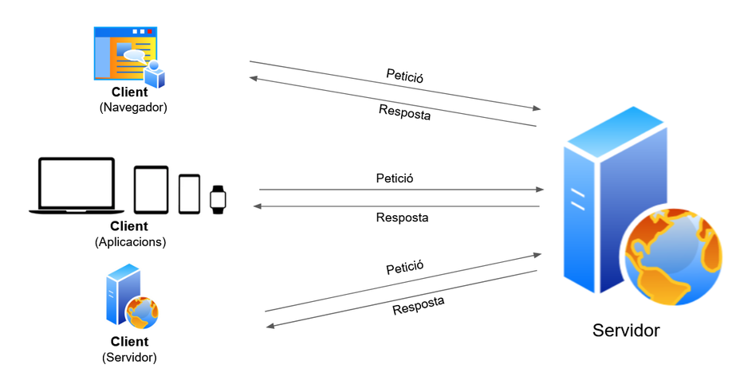

> Fixa't que un **client** no ha de ser necessàriament una persona davant d'un navegador: pot ser una aplicació mòbil, un rellotge intel·ligent o **un altre servidor** que demana dades.

La comunicació sempre segueix el mateix patró: **petició → resposta**:

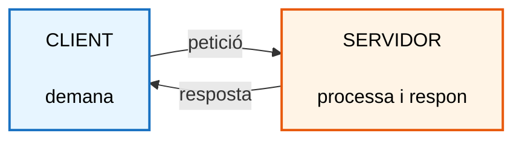

> **Regla d'or:** el client **sempre inicia** la conversa. El servidor espera i respon; no "truca" el client per iniciativa pròpia).

### 1.1 El client/servidor a la web

En l'entorn web, **què és el client i què és el servidor?**

 - El **client** és el **navegador** (Chrome, Firefox, Edge, Safari...) 
 Interpreta l'html, css i javascript i renderitza per pantalla el seu contingut.
 - El **servidor** és un **servidor web** (Apache, Nginx, IIS...). 
 És on hi ha l'html,css i js i l'envia al client.
 
 Parlen entre ells amb el protocol **HTTP** o **HTTPS**.

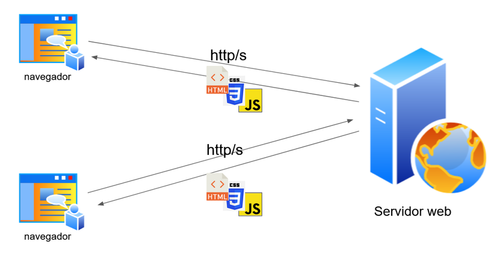

---

## 2. Què passa quan escrius una URL

Quan escrius `https://www.botiga.cat/productes` i prems Enter, passen moltes coses en menys d'un segon:

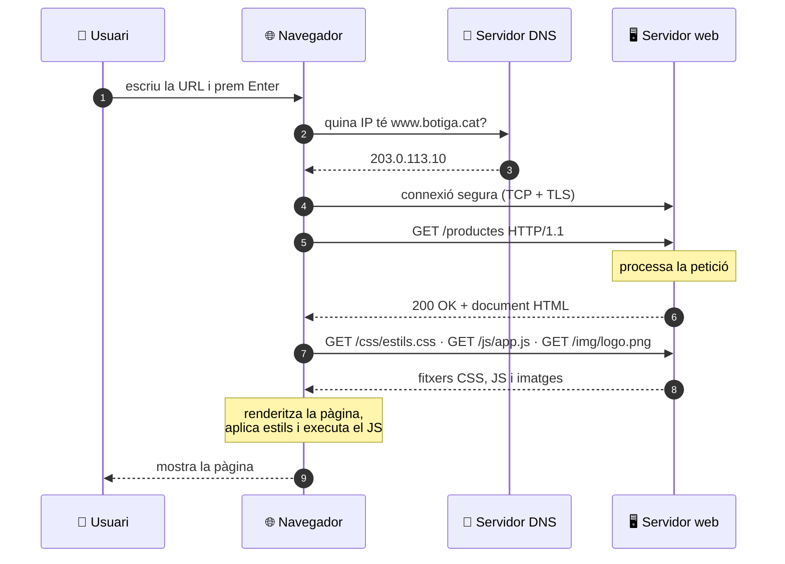

Els **codis d'estat** indiquen com ha anat la comunicació entre client i servidor:

| Codi | Significat | Exemple |
| :---: | :--- | :--- |
| **2xx** | Tot correcte | `200 OK`, `201 Created` |
| **3xx** | Redirecció | `301 Moved Permanently` |
| **4xx** | Error del **client** | `404 Not Found`, `403 Forbidden` |
| **5xx** | Error del **servidor** | `500 Internal Server Error` |

Els **mètodes** HTTP més habituals són:
- `GET` (obtenir) 
- `POST` (enviar/crear)
- `PUT`/`PATCH` (modificar) 
- `DELETE` (esborrar). 

---

## 3. Frontend i Backend

Habitualment el **desenvolupament d'una aplicació web** es divideix en dues parts:

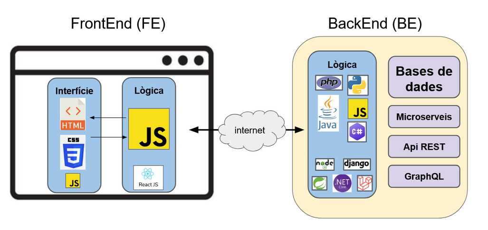

| | **Frontend (FE)** | **Backend (BE)** |
| :--- | :--- | :--- |
| **Entorn** | Client | Servidor |
| **On s'executa** | Al **navegador** de l'usuari | Al **servidor** |
| **De què s'encarrega** | Part visible i interactiva: interfície (**UI**) i experiència d'usuari (**UX**) | Lògica de negoci, dades, seguretat, autenticació |
| **Tecnologies** | HTML, CSS, JavaScript (i TypeScript) | PHP, Python, Java, C#, JavaScript (Node.js), Ruby, Go... |
| **Seguretat** | **Insegur**: el codi és visible i modificable | **Segur**: l'usuari no veu el codi |
| **Exemple** | Validar un formulari abans d'enviar-lo | Processar un pagament o autenticar un usuari |

Les dues parts es comuniquen per la xarxa (HTTP). 

> Un professional que domina les dues parts és un desenvolupador **full stack**.

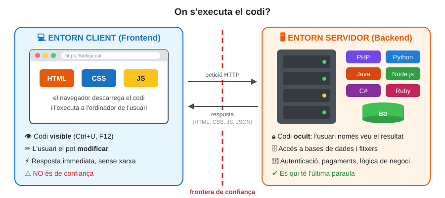

> **Mai et refiïs del client.** Qualsevol validació feta amb JavaScript al navegador es pot saltar desactivant-lo o modificant la petició. Per això es valida **als dos llocs**: al client per **comoditat** de l'usuari i al servidor per **seguretat**.

---

## 4. L'Entorn client

### 4.1 El navegador

Té dos motors principals:

- **Motor de renderitzat**: llegeix l'HTML i el CSS i dibuixa la pàgina. 
- **Motor de JavaScript**: interpreta i executa el codi JS. 

### 4.2 Llenguatges 

Una pàgina web es construeix amb **tres llenguatges** que treballen junts:

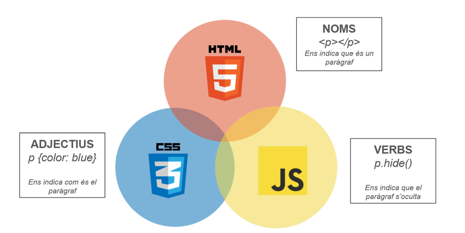

| Llenguatge | Tipus | Funció | Analogia |
| :--- | :--- | :--- | :--- |
| **HTML** | De marques | **Estructura** i contingut | Els **noms**: `
` és un paràgraf |
| **CSS** | D'estils | **Presentació** i disseny | Els **adjectius**: `p { color: blue }` |
| **JavaScript** | De programació | **Comportament** i interactivitat | Els **verbs**: `p.hidden = true` |

> **JavaScript no és Java.** Són dos llenguatges diferents; el nom es va triar per motius de màrqueting als anys 90.

### 4.3 Frameworks del client

#### Llibreries i frameworks

| Nom | Tipus | Per a què |
| :--- | :--- | :--- |
| **React** | Llibreria | Interfícies basades en components (Meta) |
| **Vue** | Framework progressiu | Interfícies reactives, corba d'aprenentatge suau |
| **Angular** | Framework complet | Aplicacions grans, amb TypeScript (Google) |
| **Bootstrap**, **Tailwind CSS** | Frameworks CSS | Disseny responsiu ràpid |
| **Chart.js**, **Leaflet** | Llibreries | Gràfics i mapes |

---

## 5. L'entorn servidor

Tornem a Filmin. Si hi entres amb el teu usuari, la pàgina et pot mostrar **la teva llista** o **les pel·lícules que tens a mitges**. El navegador no ho pot saber: ho **calcula el servidor**, i cada usuari rep una pàgina diferent.

En aquest apartat respondrem tres preguntes:

1. Quina diferència hi ha entre una pàgina **estàtica** i una de **dinàmica**?
2. Quins **programes** treballen al servidor i què fa cadascun?
3. Amb quins **llenguatges, frameworks i eines** es programa el servidor?

### 5.1 Pàgines estàtiques i dinàmiques

> - **Pàgina estàtica**: el servidor envia un fitxer **tal com està guardat**. Tothom rep exactament el mateix. *Exemple:* la pàgina "Qui som".
> - **Pàgina dinàmica**: el servidor **executa un programa** que **crea la pàgina en el moment**, normalment amb dades d'una base de dades. Cada usuari pot rebre una pàgina diferent. *Exemple:* la pàgina "La meva llista".

**Pàgina estàtica**

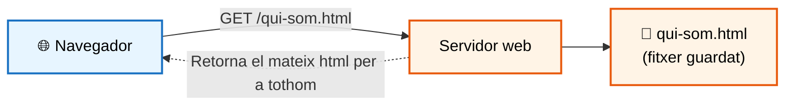

**Pàgina dinàmica**

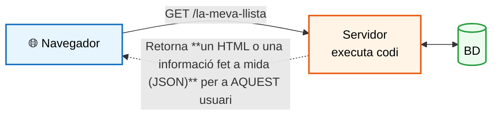

**Per què fer pàgines dinàmiques?**

| Avantatge | Exemple en una plataforma de pel·lícules |
| :--- | :--- |
| **Personalització** | Cada usuari veu la seva llista i les seves recomanacions |
| **Dades sempre actualitzades** | Una pel·lícula nova apareix al catàleg sense editar cap fitxer HTML |
| **Una plantilla, milers de pàgines** | Una sola "fitxa de pel·lícula" serveix per a totes: `/pelicula?id=1`, `/pelicula?id=2`... |
| **Control d'accés** | Només els usuaris subscrits poden reproduir la pel·lícula |

> Les pàgines estàtiques són més **ràpides** i fàcils d'allotjar. Les dinàmiques necessiten un servidor capaç d'**executar codi**.

### 5.2 Servidor web, servidor d'aplicacions i base de dades

Per servir una pàgina dinàmica hi treballen **tres programes**:

> - **Servidor web**: rep les peticions HTTP del navegador. Si li demanen un **fitxer** (HTML, CSS, JS, imatges), el retorna directament. Si cal **executar codi**, passa la petició al servidor d'aplicacions.
> - **Servidor d'aplicacions**: **executa el codi** de l'aplicació (PHP, Java, Python...) i genera una resposta a mida (HTML o JSON).
> - **Base de dades**: **guarda** les dades de manera permanent: usuaris, pel·lícules, subscripcions...

### 3. On es genera l'HTML? SSR, CSR i híbrid

Client i servidor poden repartir-se la feina de dues maneres. La diferència és **qui construeix l'HTML** que veu l'usuari.

### 3.1 Renderitzat al servidor (SSR)

> **SSR** (*Server-Side Rendering*): el servidor genera la pàgina **completa** i l'envia. Cada clic a un enllaç demana una pàgina nova.

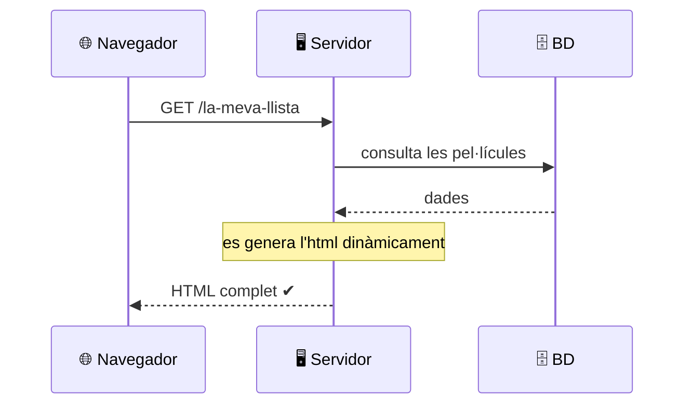

### 3.2 Renderitzat al client (CSR)

> **CSR** (*Client-Side Rendering*): el servidor envia un HTML gairebé buit i un fitxer JavaScript. El JavaScript demana **només les dades** (en format **JSON**) i construeix la pàgina al navegador. És el model de les **SPA** (*Single Page Applications*).

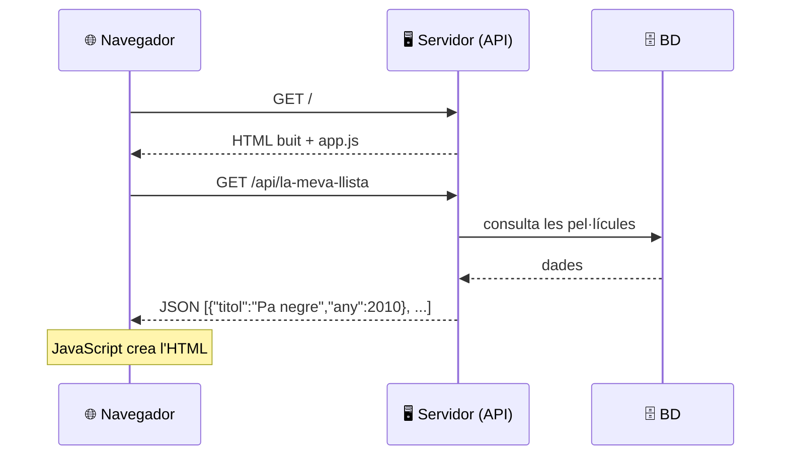
> **Model híbrid:** frameworks com **Next.js** (React) o **Nuxt** (Vue) generen la primera pàgina al servidor i després funcionen com una SPA. És una de les opcions més utilitzades avui.

### 3.3 Comparativa

| | **SSR** | **CSR** |
| :--- | :--- | :--- |
| **Qui fa l'HTML** | El servidor | El navegador (JavaScript) |
| **Què envia el servidor** | HTML complet | Dades en JSON |
| **Primera càrrega** | Ràpida | Més lenta (cal executar el JS) |
| **Navegació** | Recarrega la pàgina sencera | Fluida, sense recàrregues |
| **Surt bé a Google (SEO)** | Sí | Costa més |
| **Tecnologies** | PHP, Django, Spring, Laravel | React, Vue, Angular + una API |

### 3.4 Llenguatges i frameworks del servidor

Al navegador només s'hi executa JavaScript, però al servidor **pots triar el llenguatge**, perquè el codi s'executa en una màquina que controles tu.

| Llenguatge | Característica | Frameworks | 
| :--- | :--- | :--- | 
| **PHP** | Pensat per a la web i fàcil d'allotjar | Laravel, Symfony | 
| **Python** | Sintaxi clara, fort en dades i IA | Django, Flask, FastAPI |
| **Java** | Robust, molt utilitzat a grans empreses | Spring Boot | 
| **JavaScript** (Node.js) | El mateix llenguatge al client i al servidor | Express, NestJS | 
| **C#** | Ecosistema Microsoft (.NET) | ASP.NET Core | 

