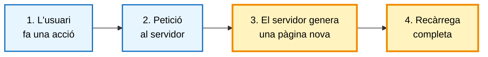
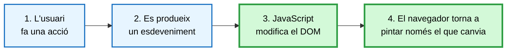
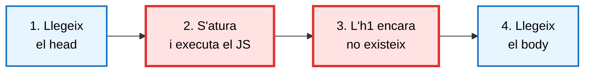
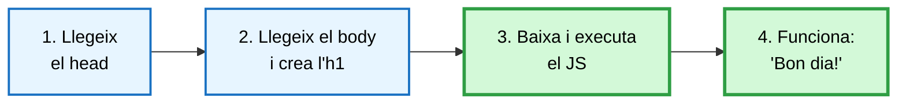
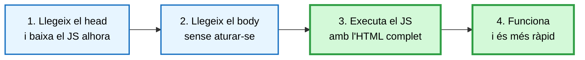
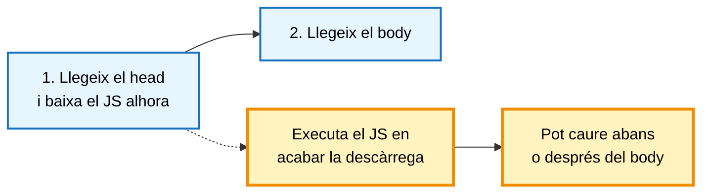

> **DSAW**  **RA2** - **INTRODUCCIÓ A JAVASCRIPT**
>
> **Mòdul**: Client (0612)
>
> **Estat**: **Revisat** 


# Introducció a JavaScript i integració amb l'HTML


## Què aprendràs

En acabar aquesta unitat has de ser capaç de:

- Explicar quines funcionalitats aporta JavaScript a una aplicació web que l'HTML i el CSS no poden oferir.
- Justificar per què JavaScript és el llenguatge de programació del client web i conèixer-ne les alternatives.
- Distingir ECMAScript de JavaScript i saber on consultar la documentació de referència.
- Incorporar codi JavaScript dins d'un document HTML de les tres maneres possibles, i saber quina és la recomanable.
- Entendre en quin ordre llegeix el navegador una pàgina web.
- Controlar quan s'executa el codi mitjançant els atributs `defer` i `async`.


---

## Índex

1. [Per què JavaScript?](#1-per-què-javascript)
2. [Integració de JavaScript amb l'HTML](#2-integració-de-javascript-amb-lhtml)


---

## 1. Per què JavaScript?

A la RA1 vam veure que al servidor es pot triar el llenguatge de programació (PHP, Python, Java, C#...), perquè el codi s'executa en una màquina que controla el desenvolupador. Al client la situació és diferent: el codi l'executa el navegador de l'usuari, i el navegador només entén de manera nativa un llenguatge de programació.

> **Nota:** JavaScript és l'únic llenguatge de programació que tots els navegadors executen de manera nativa. Aquest és el motiu principal pel qual el triem per a l'entorn client.

### 1.1 Què aporta JavaScript a una pàgina web

Una pàgina feta només amb HTML i CSS és estàtica: el navegador la mostra tal com arriba del servidor, i l'única manera de canviar-ne el contingut és demanar-ne una de nova i recarregar-la sencera. JavaScript permet que la pàgina canviï i respongui a l'usuari sense recarregar-se.

| Què permet fer | Exemple | On es treballa |
| :--- | :--- | :--- |
| Modificar el document (**DOM**) | Canviar un text o els estils, afegir files a una taula, mostrar o amagar un bloc, etc. | RA6 |
| Respondre a les accions de l'usuari (**esdeveniments**) | Clics, tecles premudes, enviament de formularis, etc. | RA5 |
| Validar dades abans d'enviar-les | Avisar que el correu no té un format correcte | RA5 |
| Desar informació al navegador | Recordar preferències o un carret de la compra | RA3 |
| Controlar el navegador | Obrir finestres, consultar la URL, anar enrere a l'historial | RA3 |
| Comunicar-se amb el servidor sense recarregar | Consultar informació o carregar més resultats sense recarregar la pàgina | RA7 |

La diferència es veu millor comparant els dos models. Sense JavaScript, qualsevol canvi implica una petició al servidor i una pàgina nova:



Amb JavaScript, el canvi es resol al mateix navegador:



#### Exemple 1. Canviar un text en prémer un botó

```html
<!-- index.html -->
<h1 id="titol">Hola</h1>
<button id="boto">Canvia el títol</button>
<script src="js/app.js" defer></script>
```

```js
// js/app.js
// 1. Obtenim una referència als elements del document
const titol = document.getElementById("titol");
const boto = document.getElementById("boto");

// 2. Quan l'usuari prem el botó, modifiquem el DOM
boto.addEventListener("click", () => {
  titol.textContent = "Bon dia!";   // la pàgina canvia sense recarregar-se
});
```

```js
// js/app.js
const comptador = document.getElementById("comptador");
const boto = document.getElementById("boto");

let clics = 0;   // estat: només existeix al navegador, el servidor no en sap res

boto.addEventListener("click", () => {
  clics++;                           // 1. actualitzem l'estat
  comptador.textContent = clics;     // 2. reflectim l'estat al DOM
});
```

### 1.2 Característiques del llenguatge

| Característica | Descripció | Conseqüència pràctica |
| :--- | :--- | :--- |
| **Interpretat** | No cal compilar-lo: el navegador el llegeix i l'executa | S'edita el fitxer, es refresca la pàgina i el canvi ja hi és |
| **Tipat dinàmic** | El tipus va lligat al valor, no a la variable: una variable pot canviar de tipus durant l'execució | És àgil d'escriure, però cal vigilar els errors de tipus |
| **Multiparadigma** | Admet programació estructurada, orientada a objectes i funcional | S'adapta al problema plantejat |
| **Estandarditzat** | Segueix la norma **ECMAScript**, amb una versió nova cada any | El mateix codi funciona a Chrome, Firefox, Safari i Edge |
| **Integrat amb el DOM** | Pot llegir i modificar la pàgina que l'usuari està visualitzant | És el que permet construir pàgines interactives |

### 1.3 Alternatives


| Opció | Descripció | Quan té sentit |
| :--- | :--- | :--- |
| JavaScript | L'estàndard del navegador | Sempre; és el punt de partida obligatori |
| **TypeScript** | JavaScript amb tipus; es compila a JavaScript | Projectes grans i equips: els errors de tipus es detecten abans d'executar |

### 1.4 ECMAScript: les versions del llenguatge

ECMAScript és l'estàndard; JavaScript n'és la implementació. Des del 2015 se'n publica una versió nova cada any.

| Versió | Any | Novetats que es fan servir en aquesta RA |
| :--- | :---: | :--- |
| ES5 | 2009 | Mode estricte, `JSON`, mètodes d'array (`forEach`, `map`...) |
| ES6 / ES2015 | 2015 | `let`, `const`, *template strings*, `for...of`, funcions fletxa |
| ES2020 | 2020 | `BigInt`, encadenament opcional `?.`, fusió nul·la `??` |

> **Nota:** la documentació de referència del llenguatge és MDN ([developer.mozilla.org](https://developer.mozilla.org)). Per a cada element indica la compatibilitat amb els diferents navegadors.


---

## 2. Integració de JavaScript amb l'HTML

El codi JavaScript s'incorpora al document HTML amb l'etiqueta `<script>`. Hi ha tres maneres de fer-ho, i només una és recomanable.

### 2.1 Les tres maneres d'incorporar codi

```html
<!-- 1. JavaScript EN LÍNIA dins d'un atribut. MALAMENT -->
<button onclick="alert('Hola')">Prem-me</button>

<!-- 2. JavaScript INTERN dins del document. Només per a proves ràpides -->
<script>
  console.log("Hola des d'un script intern");
</script>

<!-- 3. JavaScript EXTERN en un fitxer a part. L'opció que hauríem d'utilitzar -->
<script src="js/app.js" defer></script>
```

| Manera | Avantatges | Inconvenients |
| :--- | :--- | :--- |
| En línia (`onclick="..."`) | Cap | Barreja contingut i comportament; no es pot reutilitzar ni depurar |
| Intern (`<script>...</script>`) | Ràpid per a una prova puntual | No es reutilitza entre pàgines ni es desa a la memòria cau |
| Extern (`src="..."`) | Reutilitzable, cacheable, versionable amb Git i depurable | Cap de rellevant |

> **Recorda:** l'HTML és l'estructura, el CSS és l'aspecte i el JavaScript és el comportament. Cada capa ha d'anar en el seu fitxer. Aquesta independència de capes es torna a avaluar a la RA6.

### 2.2 On col·locar el `<script>`: el problema de l'ordre

Abans de parlar de `defer` i `async` cal entendre com llegeix el navegador una pàgina.

> **Recorda:** el navegador llegeix l'HTML de dalt a baix, línia per línia. Mentre és a la línia 5, encara no sap què hi ha a la línia 20.

Quan troba un `<script>`, **el navegador atura la lectura de l'HTML, executa tot el codi JavaScript i només llavors continua.** D'aquí ve l'error més habitual dels primers dies: **el codi intenta modificar un element de la pàgina que encara no s'ha creat.**

Veurem el mateix exemple en quatre situacions. El fitxer JavaScript serà sempre aquest:

```js
// js/app.js
const titol = document.getElementById("titol");
titol.textContent = "Bon dia!";
```

#### Cas 1. Al `<head>`, sense cap atribut

```html
<head>
  <script src="js/app.js"></script>     <!-- MALAMENT: aquí el navegador s'atura -->
</head>
<body>
  <h1 id="titol">Hola</h1>
</body>
```
El flux d'execució és:



Resultat: la pàgina continua mostrant "Hola" i a la consola del navegador (`F12`) apareix l'error següent.

```text
Uncaught TypeError: Cannot set properties of null (setting 'textContent')
```

L'explicació és aquesta: quan s'executa `document.getElementById("titol")`, el navegador encara no ha llegit el `<body>`. L'element `<h1>` no existeix, `getElementById` retorna `null` i `null` no té cap propietat `textContent`.

> **Nota:** el codi no és incorrecte; el que és incorrecte és el moment en què s'executa.

#### Cas 2. Al final del `<body>`

La solució tradicional consisteix a situar el `<script>` com a últim element del cos del document.

```html
<head>
</head>
<body>
  <h1 id="titol">Hola</h1>

  <script src="js/app.js"></script>     <!-- BÉ: tot l'HTML ja està llegit -->
</body>
```



Inconvenient: el navegador no comença a descarregar `app.js` fins al pas 3, quan ja ha llegit tot l'HTML. Si el fitxer és gran, es perd temps.

#### Cas 3. Al `<head>` amb `defer`

L'atribut **`defer`** indica al navegador que descarregui el fitxer mentre continua llegint la pàgina, però que no l'executi fins que hagi acabat de llegir-la tota.

```html
<head>
  <script src="js/app.js" defer></script>   <!-- BÉ: opció recomanada -->
</head>
<body>
  <h1 id="titol">Hola</h1>
</body>
```



La diferència amb el cas 2 és el moment de la descàrrega: comença al pas 1 en comptes del pas 3. S'obtenen les dues coses alhora, velocitat de càrrega i codi executat amb el document complet.

#### Cas 4. Al `<head>` amb `async`

L'atribut **`async`** també descarrega el fitxer en paral·lel, però l'executa tan bon punt acaba la descàrrega, sense esperar la resta del document.

```html
<head>
  <script src="js/app.js" async></script>   <!-- Només per a scripts independents -->
</head>
```



Això té dues conseqüències:

- Si el fitxer es descarrega molt de pressa, es torna a produir l'error del cas 1.
- Amb dos scripts marcats com a `async`, no es pot saber quin s'executarà primer: s'executa abans el que acabi de descarregar-se abans.

Per aquest motiu `async` només s'utilitza en scripts totalment independents, que no accedeixen ni al document ni a la resta de fitxers del projecte: estadístiques de visites, publicitat o xats de suport.

> **Nota:** en aquest mòdul no es fa servir `async`. El codi de les activitats sempre necessita el document construït i, per tant, sempre requereix `defer`.

#### Resum dels quatre casos

| Com s'escriu | Quan es descarrega | Quan s'executa | Pot provocar error de `null` | Quan fer-ho servir |
| :--- | :--- | :--- | :---: | :--- |
| Al `<head>`, sense atribut | Aturant la lectura | Immediatament | Sí | Mai |
| Al final del `<body>` | Al final de tot | Immediatament | No | Funciona, però és més lent |
| Al `<head>` amb `defer` | En paral·lel | Amb l'HTML complet | No | Sempre |
| Al `<head>` amb `async` | En paral·lel | En acabar la descàrrega | Sí | Analítica, publicitat |

> **Compte:** si a la consola apareix `Cannot read properties of null` o `Cannot set properties of null`, cal comprovar en primer lloc si falta l'atribut `defer` o si l'identificador està mal escrit.


---
