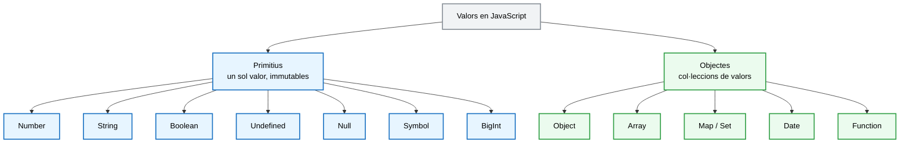

> **DSAW**  **RA2** - **SINTAXI DE JAVASCRIPT**
>
> **Mòdul**: Client (0612)
>
> **Estat**: **En revisió** 


# Escriure sentències simples amb JavaScript


## Què aprendràs

En acabar aquesta unitat has de ser capaç de:

- Declarar variables amb `const`, `let` i `var`, i saber quina correspon en cada cas.
- Identificar l'àmbit d'una variable i entendre el hoisting i la zona morta temporal.
- Distingir els tipus de dades del llenguatge i fer-ne conversions explícites i implícites.
- Utilitzar els operadors disponibles i entendre els valors *truthy* i *falsy*.
- Construir blocs de codi amb sentències de decisió (`if`, `switch`) i bucles (`for`, `while`, `do...while`).
- Comentar i documentar el codi amb criteri.
- Utilitzar les eines del navegador i de l'editor per provar i depurar el codi.

---

## Índex

1. [Variables: `const`, `let` i `var`](#1-variables-const-let-i-var)
2. [L'àmbit de les variables](#2-làmbit-de-les-variables)
3. [Tipus de dades](#3-tipus-de-dades)
4. [Conversions entre tipus](#4-conversions-entre-tipus)
5. [Operadors](#5-operadors)
6. [Valors *truthy* i *falsy*](#6-valors-truthy-i-falsy)
7. [L'objecte `Math`](#7-lobjecte-math)
8. [Sentències de decisió](#8-sentències-de-decisió)
9. [Bucles](#9-bucles)
10. [Comentaris i documentació del codi](#10-comentaris-i-documentació-del-codi)

---

## 1. Variables: `const`, `let` i `var`

Una **variable** és un nom que apunta a un espai de memòria on es guarda un valor. JavaScript ofereix tres opcions clau per declarar-les.

| Paraula clau | Quan s'utilitza | Exemple d'ús |
| :--- | :--- | :--- |
| `const` | El valor no canvia durant l'execució | Any de naixement, PI, URL fixa |
| `let` | El valor pot canviar durant l'execució | Comptadors, número aleatori |
| `var` | El valor pot canviar, però el seu ús està desaconsellat | Codi antic |

> **Recorda:** declara sempre amb `const` i passa a `let` només quan comprovis que el valor ha de canviar. No facis servir `var`.

### 1.1 Nomenclatura

- Es poden utilitzar els caràcters `0-9`, `a-z`, `A-Z`, el guió baix `_` i el símbol `$`.
- No es pot començar el nom amb un número.
- La convenció del llenguatge és **camelCase** (`nomVariableExemple`).
- Si el valor és primitiu i directe (no calculat), la constant es declara en majúscules amb guions baixos: `const BIRTH_YEAR = 1991;`.
- JavaScript distingeix majúscules i minúscules: `myage` no és el mateix que `myAge`.
- No es poden utilitzar paraules reservades del llenguatge (`for`, `if`, `class`, `return`...).
- El nom ha d'indicar què guarda la variable: `edatUsuari` és adequat, `x` o `dades2` no.

```js
// Constants: valors que no canviaran.
// En majúscules perquè són valors primitius i directes.
const BIRTH_YEAR = 1991;
const CURRENT_YEAR = 2026;

// let: el valor pot canviar. Es pot declarar sense valor inicial.
// En camelCase.
let age;

// Constant que no és un valor primitiu directe, per tant en camelCase.
const calcYear = function () {
  age = CURRENT_YEAR - BIRTH_YEAR;
  console.log(`Tens ${age} anys`);
};

calcYear();   // Tens 35 anys
```

### 1.2 `const` no vol dir immutable

> **Compte:** `const` impedeix reassignar la variable, però no impedeix modificar el contingut del valor al qual apunta.

```js
const PI = 3.1416;
PI = 3.15;                  // MALAMENT: TypeError, assignació a una constant

const colors = ["vermell", "blau"];
colors.push("verd");        // BÉ: modifiquem el contingut de l'array
console.log(colors);        // ["vermell", "blau", "verd"]

colors = ["groc"];          // MALAMENT: TypeError, reassignem la variable
```

### 1.3 Per què no s'ha d'utilitzar `var`

**Hoisting.** Les variables declarades amb `var`, i també les funcions declaratives `function nom(){}`, es reserven en memòria abans d'executar la resta del codi. Això permet utilitzar-les abans de declarar-les i provoca errors difícils de detectar.

```js
// Es crida una variable abans de declarar-la.
// No dona error: el seu valor per defecte és undefined.
console.log("El valor de la variable és: " + comptador);
// El valor de la variable és: undefined

var comptador = 3;
console.log("El valor de la variable és: " + comptador);
// El valor de la variable és: 3
```

**No respecta l'àmbit de bloc.** Una variable `var` declarada dins d'un `if` o d'un `for` continua sent accessible fora del bloc.

```js
if (true) {
  var x = 10;
  let y = 20;
}
console.log(x);   // 10, accessible fora del bloc
console.log(y);   // ReferenceError: y is not defined
```

**Permet tornar a declarar.** Es pot declarar dues vegades la mateixa variable sense cap error, cosa que amaga errors silenciosos.

```js
var count = 1;
var count = 2;      // Cap error: la primera declaració s'ha perdut
console.log(count); // 2

let total = 1;
let total = 2;      // SyntaxError: Identifier 'total' has already been declared
```

### 1.4 Per què utilitzar `const` i `let`

**Zona morta temporal (TDZ, *Temporal Dead Zone*).** Si s'utilitza una variable `let` o `const` abans de declarar-la, JavaScript llança un error explícit: la variable existeix, però no es pot fer servir fins que s'inicialitza. L'error es produeix immediatament, a diferència del comportament silenciós de `var`.

```js
console.log("El valor de la variable és: " + comptador);
let comptador = 3;
// ReferenceError: Cannot access 'comptador' before initialization
```

---

## 2. L'àmbit de les variables

### 2.1 Àmbit global

Una variable declarada fora de qualsevol funció i de qualsevol bloc és global, i per tant accessible des de tot el fitxer.

```js
const NOM_APP = "Encerta el número";   // àmbit global

function mostrarTitol() {
  console.log(NOM_APP);             // accedeix a la variable global
}
mostrarTitol();
```

### 2.2 Àmbit de funció

Les variables declarades dins d'una funció només existeixen mentre la funció s'executa.

```js
function calcularPunts() {
  let punts = 10;          // àmbit de funció
  return punts * 2;
}

console.log(calcularPunts());  // 20
console.log(punts);            // ReferenceError: punts is not defined
```

### 2.3 Àmbit de bloc

Un bloc és qualsevol parell de claus `{ }`: el cos d'un `if`, d'un `for`, d'un `while` o unes claus soltes. Les declaracions `let` i `const` queden limitades al bloc; `var` no.

```js
for (let i = 0; i < 3; i++) {
  console.log(i);     // 0, 1, 2
}
console.log(i);       // ReferenceError

for (var j = 0; j < 3; j++) { }
console.log(j);       // 3, la variable var sobreviu al bucle
```

### 2.4 Variables no declarades

Si s'assigna un valor a un nom sense `const`, `let` ni `var`, JavaScript crea una variable global implícita, encara que l'assignació es faci dins d'una funció.

```js
function sumar() {
  resultat = 5 + 3;     // MALAMENT: sense declarar, es crea com a global
}
sumar();
console.log(resultat);  // 8, la variable s'ha escapat de la funció
```

---

## 3. Tipus de dades

JavaScript distingeix entre valors primitius i objectes.



Els mateixos tipus, en forma de llista:

**Tipus primitius**: contenen un sol valor i són immutables.

| Tipus | Què representa | Exemple | `typeof` |
| :--- | :--- | :--- | :--- |
| `Number` | Nombres enters i decimals | `42`, `3.14` | `'number'` |
| `String` | Text | `"Marta"` | `'string'` |
| `Boolean` | Cert o fals | `true`, `false` | `'boolean'` |
| `Undefined` | Variable declarada sense valor assignat | `let x;` | `'undefined'` |
| `Null` | Absència de valor intencionada | `null` | `'object'` |
| `Symbol` | Identificador únic | `Symbol("id")` | `'symbol'` |
| `BigInt` | Enters de mida arbitrària | `992n` | `'bigint'` |

**Objectes**: agrupen diversos valors o comportament.

| Tipus | Què representa | Exemple | `typeof` |
| :--- | :--- | :--- | :--- |
| `Object` | Conjunt de parells clau-valor | `{ nom: "Marta" }` | `'object'` |
| `Array` | Llista ordenada de valors | `[1, 2, 3]` | `'object'` |
| `Map` / `Set` | Col·leccions de parells clau-valor / de valors únics | `new Map()`, `new Set()` | `'object'` |
| `Date` | Data i hora | `new Date()` | `'object'` |
| `Function` | Bloc de codi reutilitzable | `function f() {}` | `'function'` |

> Font: [MDN – Estructures de dades JS](https://developer.mozilla.org/es/docs/Web/JavaScript/Data_structures)

JavaScript és un llenguatge de **tipat dinàmic**: el tipus va lligat al valor, no a la variable, i per tant una variable pot canviar de tipus durant l'execució. L'operador `typeof` permet consultar en tot moment el tipus d'un valor.

```js
// NUMBER (sencer o decimal: JavaScript no els distingeix)
const num1 = 33;
const decimal1 = 5.25;
console.log(num1, typeof num1);          // 33 'number'
console.log(decimal1, typeof decimal1);  // 5.25 'number'

// STRING (text)
const nom = "Marta";
console.log(nom, typeof nom);            // 'Marta' 'string'

// BOOLEAN
const estaActiu = true;
console.log(estaActiu, typeof estaActiu); // true 'boolean'

// UNDEFINED (declarada però sense cap valor assignat)
let saldo;
console.log(saldo, typeof saldo);        // undefined 'undefined'

// NULL (buit de manera intencionada)
const error = null;
console.log(error, typeof error);        // null 'object'

// SYMBOL (identificador únic i immutable)
const idUnic = Symbol("id");
console.log(idUnic, typeof idUnic);      // Symbol(id) 'symbol'

// BIGINT (enter de precisió arbitrària)
const numeroGran = 992n;
console.log(numeroGran, typeof numeroGran); // 992n 'bigint'
```

> **Compte:** `typeof null` retorna `'object'`. És un error de la primera versió de JavaScript que no s'ha pogut corregir sense trencar la compatibilitat. Per comprovar si un valor és `null` cal escriure `valor === null`.

### 3.1 `undefined` i `null`

| | `undefined` | `null` |
| :--- | :--- | :--- |
| Significat | Encara no se li ha assignat cap valor | No hi ha cap valor, de manera intencionada |
| Qui l'assigna | JavaScript | El programador |
| `typeof` | `'undefined'` | `'object'` |
| Exemple | `let x;` | `let usuari = null;` |

### 3.2 `Number`

```js
const enter = 42;
const decimal = 3.14;
const negatiu = -7;
const exponencial = 2.5e3;      // 2500

console.log(0.1 + 0.2);         // 0.30000000000000004
console.log(10 / 0);            // Infinity
console.log("hola" * 2);        // NaN
```

> **Compte:** els números es representen en binari amb precisió limitada (estàndard IEEE-754) i per això `0.1 + 0.2` no dona exactament `0.3`. Per comparar decimals cal arrodonir abans: `(0.1 + 0.2).toFixed(2) === "0.30"`.

Mètodes més utilitzats:

| Mètode | Funció | Exemple | Resultat |
| :--- | :--- | :--- | :--- |
| `toFixed(n)` | Arrodoneix a `n` decimals i retorna un string | `(3.14159).toFixed(2)` | `"3.14"` |
| `Number.isInteger()` | Comprova si el valor és un enter | `Number.isInteger(5.0)` | `true` |
| `Number.isNaN()` | Comprova si el valor és `NaN` | `Number.isNaN(NaN)` | `true` |

> **Compte:** `NaN` és una forma d'indicar que no és un number.


La manera correcta de comprovar si un valor conté un número és **convertir-lo primer a number i comprovar el resultat després**:

```js
//Cas en el que donaria que és un number
let valor = 1.1;

let valorNumber = Number(valor);

if(Number.isNaN(valorNumber)){
    console.log("El valor no és un number");
}
else{ console.log("El valor és un number")}


//Cas en el que donaria que NO és un number
let valor = "hola";

let valorNumber = Number(valor);

if(Number.isNaN(valorNumber)){
    console.log("El valor no és un number");
}
else{ console.log("El valor és un number")}
```

Les altres comprovacions disponibles, `Number.isInteger()` i `Number.isFinite()`, tampoc no converteixen: només responen `true` si el valor ja és del tipus `number`.

```js
Number.isInteger(5);       // true
Number.isInteger(5.0);     // true,  5.0 i 5 són el mateix número
Number.isInteger(5.5);     // false
Number.isInteger("5");     // false, és una cadena, no un número

Number.isFinite(42);       // true
Number.isFinite(Infinity); // false
Number.isFinite("42");     // false, no converteix
isFinite("42");            // true,  la versió antiga sí que converteix

```


> **Recorda:** fes servir sempre les versions amb el prefix `Number.` i converteix tu el valor abans de comprovar-lo. Les versions globals `isNaN()` i `isFinite()` converteixen pel seu compte i amaguen el que realment està passant.

> Font: [MDN – Number](https://developer.mozilla.org/en-US/docs/Web/JavaScript/Reference/Global_Objects/Number)


### 3.3 `String`

```js
// Primitius
const text1 = 'Hello JS';                 // cometes simples
const text2 = "Hello JavaScript";         // cometes dobles
const text3 = `Hello ${text1}`;           // template string, amb accent greu

// String() sense new converteix a cadena i retorna un primitiu
const text4 = String(42);                 // "42", typeof 'string'

// Només amb new es crea un objecte. No s'utilitza a la pràctica
const text5 = new String("Hello JavaScript");   // typeof 'object'
```

Caràcters especials:

| Seqüència | Funció |
| :---: | :--- |
| `\n` | Salt de línia |
| `\t` | Tabulació horitzontal |
| `\b` | Retrocés |
| `\\` | Barra invertida |
| `\'` | Cometa simple |
| `\"` | Cometa doble |

Mètodes i propietats més utilitzats:

| Mètode o propietat | Funció | Exemple | Resultat |
| :--- | :--- | :--- | :--- |
| `length` | Llargada de la cadena | `"Marta".length` | `5` |
| `indexOf(text)` | Posició del text, o `-1` si no hi és | `"Marta".indexOf("r")` | `2` |
| `charAt(i)` | Caràcter de la posició `i` | `"Marta".charAt(0)` | `"M"` |
| `includes(text)` | Indica si el text hi és present | `"Marta".includes("art")` | `true` |
| `trimStart()` / `trimEnd()` / `trim()` | Elimina espais a l'inici, al final o a tots dos | `"  hola  ".trim()` | `"hola"` |
| `replace(a, b)` | Substitueix `a` per `b` | `"gat".replace("g", "c")` | `"cat"` |
| `slice(inici, fi)` | Subcadena entre dues posicions | `"JavaScript".slice(0, 4)` | `"Java"` |
| `split(separador)` | Trenca la cadena i retorna un array | `"a,b,c".split(",")` | `["a","b","c"]` |
| `toUpperCase()` / `toLowerCase()` | Converteix a majúscules o minúscules | `"js".toUpperCase()` | `"JS"` |
| `padStart(n, c)` / `padEnd(n, c)` | Emplena fins a una longitud determinada | `"7".padStart(2, "0")` | `"07"` |

> Font: [MDN – String](https://developer.mozilla.org/es/docs/Web/JavaScript/Reference/Global_Objects/String)

> **Compte:** les cadenes són immutables. Cap d'aquests mètodes modifica l'original; tots en retornen una de nova. La instrucció `nom.toUpperCase();` aïllada no té cap efecte: cal `const nomMaj = nom.toUpperCase();`.

Concatenació de text amb variables:

```js
const edat = 35;

// Amb l'operador +
const missatge1 = "Tens " + edat + " anys";

// Amb el mètode concat()
const missatge2 = "Tens ".concat(edat, " anys");

// Amb template string, forma recomanada
const missatge3 = `Tens ${edat} anys`;

// Els template strings admeten expressions i salts de línia reals
const missatge4 = `L'any que ve en tindràs ${edat + 1}.
I això és una segona línia.`;
```

### 3.4 `Boolean`

Només té dos valors, `true` i `false`, i és el resultat de qualsevol comparació.

```js
const major = 18 >= 18;        // true
const buit = "".length === 0;  // true
console.log(typeof major);     // 'boolean'
```

### 3.5 L'objecte `Date`

| Constructor | Paràmetre |
| :--- | :--- |
| `new Date()` | Sense paràmetres, pren la data actual del sistema |
| `new Date(valor)` | Enter amb els mil·lisegons transcorreguts des de l'1 de gener de 1970 00:00:00 UTC (època UNIX) |
| `new Date(dataString)` | Cadena amb una data en un format reconegut per `Date.parse()`:<br/>`month/date/year`, per exemple `6/13/2004`<br/>`month_name date, year`, per exemple `January 12, 2004`<br/>`day_of_week month_name date year hours:minutes:seconds time_zone`, per exemple `Tue May 25 2004 00:00:00 GMT-0700`<br/>ISO 8601 `YYYY-MM-DDTHH:mm:ss.sssZ`, per exemple `2004-05-25T00:00:00` |

```js
const ara = new Date();

console.log(ara.getFullYear());        // 2026
console.log(ara.getMonth());           // 8, els mesos van de 0 (gener) a 11 (desembre)
console.log(ara.getDate());            // 20, dia del mes
console.log(ara.getDay());             // 0, dia de la setmana (0 = diumenge)
console.log(ara.toLocaleDateString()); // "20/9/2026"
console.log(ara.toLocaleTimeString()); // "18:35:12"
```

> Font: [MDN – Date](https://developer.mozilla.org/es/docs/Web/JavaScript/Reference/Global_Objects/Date)


---

## 4. Conversions entre tipus

A més de ser de tipat dinàmic, JavaScript és de tipat feble: quan una operació combina valors de tipus diferents, no dona error sinó que converteix els valors d'un tipus a un altre. Ho pot fer de dues maneres.


### 4.1 Conversió explícita

La fa el programador i, per tant, és la recomanada.

| Funció | Comportament |
| :--- | :--- |
| `Number(valor)` | Estricta: només converteix números sense lletres; en cas contrari retorna `NaN` |
| `parseInt(valor)` | Tolerant: ignora els caràcters posteriors al número i no admet decimals |
| `parseFloat(valor)` | Tolerant, igual que `parseInt`, però admet decimals |
| `Boolean(valor)` | Converteix a `true` o `false`; útil per comprovar si un valor és *falsy* |
| `String(valor)` | Qualsevol valor es pot convertir a cadena |

```js
// Number(): conversió estricta
console.log(Number("42"));       // 42
console.log(Number("42.5"));     // 42.5
console.log(Number("42px"));     // NaN, no admet lletres
console.log(Number(""));         // 0, la cadena buida es converteix en 0
console.log(Number(true));       // 1

// parseInt(): tolerant, sense decimals
console.log(parseInt("42px"));   // 42
console.log(parseInt("42.9"));   // 42, trunca en lloc d'arrodonir
console.log(parseInt("px42"));   // NaN, ha de començar per número

// parseFloat(): tolerant, amb decimals
console.log(parseFloat("42.9px")); // 42.9

// Boolean()
console.log(Boolean(""));        // false
console.log(Boolean("hola"));    // true
console.log(Boolean(0));         // false

// String()
console.log(String(42));         // "42"
console.log(String(null));       // "null"
console.log((42).toString());    // "42"
```


### 4.2 Conversió implícita

JavaScript la fa automàticament quan es barregen tipus en una operació. És la font d'errors més habitual del llenguatge.

```js
console.log("5" + 3);        // "53", el + amb una cadena concatena
console.log("5" - 3);        // 2, la resta converteix a número
console.log("5" * "2");      // 10
console.log(5 + true);       // 6, true equival a 1
console.log(5 + null);       // 5, null equival a 0
console.log(5 + undefined);  // NaN
console.log([] + {});        // "[object Object]"
```


---

## 5. Operadors

> Font: [MDN – Operadors i matemàtiques bàsiques](https://developer.mozilla.org/es/docs/Learn/JavaScript/First_steps/Math)

### 5.1 Aritmètics

| Operador | Funció | Exemple | Resultat |
| :---: | :--- | :--- | :--- |
| `+` | Suma | `7 + 2` | `9` |
| `-` | Resta | `7 - 2` | `5` |
| `*` | Multiplicació | `7 * 2` | `14` |
| `/` | Divisió | `7 / 2` | `3.5` |
| `%` | Mòdul o residu | `7 % 2` | `1` |
| `**` | Potència | `7 ** 2` | `49` |
| `++` | Autoincrement | `cont++` | |
| `--` | Autodecrement | `cont--` | |

> **Nota:** l'operador mòdul és útil en situacions freqüents: `n % 2 === 0` comprova si un número és parell, i `i % 3` permet recórrer cíclicament tres valors.

### 5.2 Assignació

| Operador | Funció |
| :---: | :--- |
| `=` | Assigna |
| `+=` | Suma i assigna |
| `-=` | Resta i assigna |
| `*=` | Multiplica i assigna |
| `/=` | Divideix i assigna |
| `%=` | Calcula el mòdul i assigna |

```js
let a = 100;
a += 10;   // 110
a -= 15;   // 95
a *= 10;   // 950
a /= 2;    // 475
a %= 2;    // 1, perquè 475 és senar
```

### 5.3 Pre i post increment

```js
let cont = 5;

console.log(cont++);   // 5, retorna primer i incrementa després
console.log(cont);     // 6

let altre = 5;
console.log(++altre);  // 6, incrementa primer i retorna després
console.log(altre);    // 6
```

En tots dos casos la variable s'incrementa immediatament. La diferència és el valor que retorna l'expressió: `cont++` retorna el valor que tenia abans d'incrementar-se, i `++cont` retorna el valor ja actualitzat. El mateix s'aplica a l'operador `--`.

### 5.4 Comparació

| Operador | Funció |
| :---: | :--- |
| `>` | Major que |
| `>=` | Major o igual que |
| `<` | Menor que |
| `<=` | Menor o igual que |
| `==` | Igualtat: compara només el valor i converteix tipus |
| `===` | Igualtat estricta: compara valor i tipus |
| `!=` | Desigualtat: compara només el valor |
| `!==` | Desigualtat estricta: compara valor i tipus |

```js
"55" == 55;    // true, converteix la cadena a número i compara
"55" === 55;   // false, string no és number
"55" != 55;    // false
"55" !== 55;   // true

// Casos poc intuïtius de l'operador ==
"" == 0;            // true
null == undefined;  // true
[] == false;        // true
```

> **Recorda:** utilitza sempre `===` i `!==`. Els operadors `==` i `!=` apliquen conversions que no s'han demanat. Aquesta és la regla `eqeqeq` d'ESLint.

### 5.5 Lògics

| Operador | Funció | Retorna `true` quan |
| :---: | :--- | :--- |
| `!` | Negació | L'operand és `false` |
| `&&` | Conjunció | Tots dos operands són `true` |
| `\|\|` | Disjunció | Almenys un dels dos és `true` |

```js
const edat = 20;
const teCarnet = true;

console.log(edat >= 18 && teCarnet);   // true
console.log(edat < 18 || teCarnet);    // true
console.log(!teCarnet);                // false
```


### 5.6 Operador ternari

És una forma compacta d'escriure una sentència `if...else` que assigna un valor.

```js
// variable = condició ? valor_si_cert : valor_si_fals;

const max = (num1 > num2) ? num1 : num2;
const missatge = (edat >= 18) ? "Pots passar" : "Ets menor d'edat";
```

> **Compte:** fes servir l'operador ternari només per a condicions simples. Si cal encadenar-ne diversos, una sentència `if...else` és més llegible.


### 5.7 Precedència

Les operacions s'avaluen en un ordre determinat. Els parèntesis el modifiquen i milloren la llegibilitat.

```js
console.log(2 + 3 * 4);      // 14, primer la multiplicació
console.log((2 + 3) * 4);    // 20
console.log(5 > 3 === true); // true
```

> **Recorda:** davant del dubte, posa parèntesis.


---

## 6. Valors *truthy* i *falsy*

Tot valor de JavaScript té un equivalent booleà: es pot convertir a `true` o a `false`. És un concepte clau per escriure condicions, perquè permet comprovar amb una sola expressió si una variable està declarada, informada o buida.

> Hi ha vuit valors *falsy*: `false`, `0`, `-0`, `0n`, `""`, `null`, `undefined` i `NaN`. Tota la resta són *truthy*.


| Valor | Descripció |  És *falsy* quan |
| :--- | :--- | :--- |
| `undefined` | La variable no té cap valor assignat | `let numProd;`<br/>`if (numProd) {`<br/>&nbsp;&nbsp;`console.log("Està definida");`<br/>`} else {`<br/>&nbsp;&nbsp;`console.log("NO està definida"); // resultat`<br/>`}` |
| `0` | El valor numèric de la variable és 0 | `let numProd = 0;`<br/>`if (numProd) {`<br/>&nbsp;&nbsp;`console.log("Té valor");`<br/>`} else {`<br/>&nbsp;&nbsp;`console.log("No té valor"); // resultat`<br/>`}` |
| `""` | El valor de la variable és la cadena buida | `let nom = "";`<br/>`if (nom) {`<br/>&nbsp;&nbsp;`console.log("Té valor");`<br/>`} else {`<br/>&nbsp;&nbsp;`console.log("No té valor"); // resultat`<br/>`}` |
| `NaN` | La variable conté el resultat d'una operació o conversió numèrica que no ha donat un número vàlid |  `const numProd = Number("Computer"); // NaN`<br/>`if (numProd) {`<br/>&nbsp;&nbsp;`console.log("És un número");`<br/>`} else {`<br/>&nbsp;&nbsp;`console.log("No és un número"); // resultat`<br/>`}` |
| `null` | La variable està definida però buida de manera intencionada | `const numProd = null;`<br/>`if (numProd) {`<br/>&nbsp;&nbsp;`console.log("Té un valor");`<br/>`} else {`<br/>&nbsp;&nbsp;`console.log("NO té valor"); // resultat`<br/>`}` |

> Font: [MDN – Falsy](https://developer.mozilla.org/en-US/docs/Glossary/Falsy)


---

## 7. L'objecte `Math`

`Math` és un objecte predefinit amb constants i funcions matemàtiques. No cal instanciar-lo: s'utilitza directament.

| Funció | Definició | Exemple | Resultat |
| :--- | :--- | :--- | :---: |
| `Math.PI` | Retorna el número Pi | `Math.PI` | `3.1415...` |
| `Math.round()` | Arrodoneix a l'enter més proper; si la part decimal és exactament ,5, arrodoneix cap a l'enter superior (`Math.round(-2.5)` dona `-2`) | `Math.round(2.5)` | `3` |
| `Math.ceil()` | Arrodoneix sempre a l'alça | `Math.ceil(2.2)` | `3` |
| `Math.floor()` | Arrodoneix sempre a la baixa | `Math.floor(2.2)` | `2` |
| `Math.sqrt()` | Arrel quadrada | `Math.sqrt(144)` | `12` |
| `Math.abs()` | Valor absolut | `Math.abs(-300)` | `300` |
| `Math.pow()` | Potència | `Math.pow(8, 3)` | `512` |
| `Math.min()` | Retorna el valor mínim | `Math.min(4, 2, 1, -3)` | `-3` |
| `Math.max()` | Retorna el valor màxim | `Math.max(21, 4, 11, 5)` | `21` |

### 7.1 `Math.random()`

```js
Math.random();                                     // decimal entre 0 inclòs i 1 exclòs
Math.floor(Math.random());                         // sempre 0
Math.floor(Math.random() * valorMax);              // enter entre 0 i valorMax - 1
Math.floor(Math.random() * (max - min + 1) + min); // enter entre min i max, ambdós inclosos
```

```js
// Número secret entre 1 i 20, ambdós inclosos
const MIN = 1;
const MAX = 20;
const numeroSecret = Math.floor(Math.random() * (MAX - MIN + 1) + MIN);
console.log(numeroSecret);   // per exemple, 15
```

> Font: [MDN – Math](https://developer.mozilla.org/es/docs/Web/JavaScript/Reference/Global_Objects/Math)


---

## 8. Sentències de decisió

Les sentències de decisió permeten executar un bloc de codi o un altre segons si es compleix una condició.

### 8.1 `if`, `else` i `else if`


```js
// Sentència if sense else
if (expressio) {
  instruccions_si_true;
}

// Sentència if amb else
if (expressio) {
  instruccions_si_true;
} else {
  instruccions_si_false;
}

// Sentència encadenada amb else if
if (nota >= 9) {
  qualificacio = "Excel·lent";
} else if (nota >= 7) {
  qualificacio = "Notable";
} else if (nota >= 5) {
  qualificacio = "Aprovat";
} else {
  qualificacio = "Suspès";
}
```


> **Recorda:** escriu sempre les claus `{ }`, encara que el bloc tingui una sola instrucció. Això evita errors quan més endavant s'hi afegeix una segona línia.

### 8.2 `switch`

Quan es compara una mateixa variable amb diversos valors concrets, `switch` resulta més llegible que un `if...else if` llarg.


```js
switch (expressio) {
  case valor1:
    instruccions;
    break;
  case valor2:
    instruccions2;
    break;
  default:
    instruccions_else;
}
```

Exemple d'aplicació:

```js
const dia = new Date().getDay();   // 0 = diumenge ... 6 = dissabte
let nomDia;

switch (dia) {
  case 0:
  case 6:
    nomDia = "Cap de setmana";     // dos case units comparteixen el mateix bloc
    break;
  case 1:
    nomDia = "Dilluns";
    break;
  case 5:
    nomDia = "Divendres";
    break;
  default:
    nomDia = "Entre setmana";
}

console.log(nomDia);
```

> **Compte:** sense la instrucció `break`, l'execució continua cap al `case` següent i s'executen tots els blocs posteriors.

---

## 9. Bucles

Un bucle repeteix un bloc d'instruccions mentre es compleix una condició.

### 9.1 `for`

```js
for (valor_inicial; condició; increment_o_decrement) {
  // instruccions
}
```

```js
const total = 10;
for (let i = 0; i < total; i++) {
  console.log(i);     // 0, 1, 2, ... 9
}

// Recorregut en sentit invers
for (let i = total; i > 0; i--) {
  console.log(i);     // 10, 9, 8, ... 1
}
```

> **Recorda:** declara el comptador amb `let`, mai amb `var`, perquè quedi limitat al bucle.

### 9.2 `for...of`

Quan només calen els elements d'una col·lecció i no la seva posició, `for...of` és més clar.

```js
for (const element of colleccio) {
  // a cada iteració, element és un dels valors de la col·lecció
}

const animals = ["gos", "gat", "cavall"];
for (const animal of animals) {
  console.log(animal);    // "gos", "gat", "cavall"
}

// També funciona amb cadenes de text
for (const lletra of "JS") {
  console.log(lletra);    // "J", "S"
}
```

> **Nota:** dins d'un `for...of` es declara la variable amb `const`, perquè a cada iteració se'n crea una de nova.

### 9.3 `while` i `do...while`

```js
// while: comprova primer i executa després
while (expressio) {
  // instruccions
}

let i = 0;
while (i < 10) {
  i += 2;
}

// do...while: executa primer i comprova després
do {
  // instruccions
} while (expressio);

let j = 0;
do {
  j += 2;
} while (j < 10);
```

> **Recorda:** el cos d'un `do...while` s'executa com a mínim una vegada, perquè la condició es comprova al final. El d'un `while` pot no executar-se cap vegada.

### 9.4 Quin bucle triar

| Situació | Bucle recomanat |
| :--- | :--- |
| Es coneix el nombre d'iteracions | `for` |
| Cal recórrer tots els elements d'un array o d'una cadena | `for...of` |
| Cal repetir mentre es compleixi una condició, i pot no executar-se cap vegada | `while` |
| Cal repetir mentre es compleixi una condició, però com a mínim una vegada | `do...while` |

### 9.5 `break` i `continue`

La instrucció `break` interromp l'execució i salta a la primera línia posterior al bucle, és a dir, surt del bucle. La instrucció `continue` interromp la iteració actual i salta a la següent, sense sortir del bucle.

```js
// break: atura el bucle en trobar el valor buscat
const noms = ["Anna", "Bru", "Cesc", "Dina"];
for (const nom of noms) {
  if (nom === "Cesc") {
    console.log("Trobat");
    break;              // no continua amb "Dina"
  }
}

// continue: descarta els números senars
for (let i = 0; i < 10; i++) {
  if (i % 2 !== 0) {
    continue;           // salta a la iteració següent
  }
  console.log(i);       // 0, 2, 4, 6, 8
}
```


---

## 10. Comentaris i documentació del codi

Un comentari és text que el navegador ignora i que serveix perquè una persona entengui el codi.

### 10.1 Sintaxi

```js
// Comentari d'una sola línia

/*
  Comentari
  de diverses línies
*/

const IVA = 0.21;   // també pot anar al final d'una línia de codi
```


