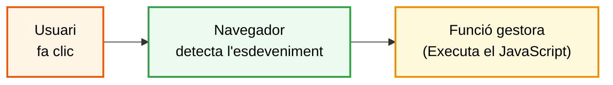

> **DSAW**  **RA5** - **GESTIÓ D'ESDEVENIMENTS**
>
> **Mòdul**: Client (0612)
>
> **Estat**: **En revisió**


# Gestió d'esdeveniments


## Què aprendràs

En acabar aquesta unitat has de ser capaç de:

- Explicar què és un **esdeveniment** i com funciona la programació dirigida per esdeveniments al navegador.
- Associar esdeveniments als elements de la pàgina i saber per què `addEventListener` és l'opció recomanada.
- Distingir els principals tipus d'esdeveniments.
- Utilitzar l'objecte `event` per saber què ha passat i on, aturar el comportament per defecte i entendre la propagació.
- Provar el codi que gestiona esdeveniments amb les eines del navegador.

> **Nota:** aquesta unitat es treballa conjuntament amb la RA6 (*El model d'objectes del document*).

> **Nota:** la RA5 té dos documents de teoria. Aquest és el primer. La gestió de formularis, la validació i les expressions regulars es treballen al segon document, *Formularis, validació i expressions regulars*.

---

## Índex

1. [Què és un esdeveniment](#1-què-és-un-esdeveniment)
2. [Associar esdeveniments als elements](#2-associar-esdeveniments-als-elements)
3. [Tipus d'esdeveniments](#3-tipus-desdeveniments)
4. [L'objecte `event`](#4-lobjecte-event)

---

## 1. Què és un esdeveniment

Un **esdeveniment** (*event*) és qualsevol cosa que passa a la pàgina i que el navegador és capaç de detectar: l'usuari fa clic en un botó, prem una tecla, escriu en un camp, envia un formulari, o la pàgina acaba de carregar-se.

Fins ara els programes s'executaven de dalt a baix i acabaven. A les aplicacions web, en canvi, el codi es prepara quan es carrega la pàgina i després **espera**. Cada vegada que passa un esdeveniment, el navegador executa la funció que hi hem associat. Aquesta manera de programar s'anomena **programació dirigida per esdeveniments**.



La funció que s'executa quan passa un esdeveniment s'anomena *event handler* o *listener*.

### 1.1 El patró bàsic

Tot el codi d'aquesta unitat segueix els mateixos quatre passos:

```html
<button id="enviar">Enviar</button>
<p id="missatge"></p>
```

```js
// 1. Seleccionar l'element
const boto = document.querySelector("#enviar");

// 2. Definir què ha de passar
const enClicar = () => {
  // 3. Executar el codi JS
  document.querySelector("#missatge").textContent = "Enviat";
};

// 4. Connectar l'esdeveniment amb la funció
boto.addEventListener("click", enClicar);
```

---

## 2. Associar esdeveniments als elements

Hi ha tres maneres d'associar una funció a un esdeveniment. Només una és recomanada, però cal conèixer les altres perquè apareixen a molt de codi.

### 2.1 Atributs d'esdeveniment a l'HTML (**NO RECOMANAT**)

L'HTML permet capturar esdeveniments directament amb atributs que comencen per `on`:

```html
<!-- MALAMENT: el comportament queda barrejat amb el contingut -->
<button onclick="saludar()">Saluda</button>
<body onload="iniciar()">
<input oninput="comptarCaracters()">
<form onsubmit="return validar()">
```

Funciona, però té inconvenients:

- Barreja les capes: l'HTML conté codi JavaScript (RA6, apartat 5).
- La funció ha de ser global, és a dir, accessible des de qualsevol lloc.
- Per canviar el comportament cal modificar cada etiqueta.

> **Compte:** coneix aquests atributs per poder llegir codi antic o d'exemples d'internet, però no els facis servir en el teu codi.

### 2.2 La propietat `on...` de l'element (**NO RECOMANAT**)

Cada element té una propietat per a cada esdeveniment (`onclick`, `oninput`...). S'hi pot assignar una funció des de JavaScript:

```js
const boto = document.querySelector("#enviar");

boto.onclick = () => {
  console.log("Hola");
};

// Problema: una segona assignació substitueix la primera
boto.onclick = () => {
  console.log("Adeu");
};
// En fer clic només es mostra "Adeu"
```

Aquesta opció separa les capes, però cada element només pot tenir **una** funció per esdeveniment.

### 2.3 `addEventListener` (**OPCIÓ RECOMANADA**)

```js
element.addEventListener(tipus, funcio);
```

- `tipus`: nom de l'esdeveniment, **sense** el prefix `on` (`"click"`, no `"onclick"`).
- `funcio`: la funció que s'executarà. Es pot passar el nom d'una funció definida abans o escriure-la directament.

```js
const boto = document.querySelector("#enviar");

// Opció A: funció definida abans (recomanada si és llarga o es reutilitza)
const saludar = () => {
  console.log("Hola");
};
boto.addEventListener("click", saludar);

// Opció B: funció fletxa escrita directament (habitual si és curta)
boto.addEventListener("click", () => {
  console.log("Segona acció");
});

// En fer clic s'executen les dues, en l'ordre en què s'han afegit
```

### 2.4 Com es passa la funció a `addEventListener`

`addEventListener` no executa la funció que rep. La **guarda**, i és el navegador qui la crida cada vegada que passa l'esdeveniment. **Per això el segon paràmetre ha de ser una funció, no el resultat d'executar-la**.

#### 1. El nom d'una funció definida abans

```js
const saludar = () => {
  console.log("Hola");
};

boto.addEventListener("click", saludar);     // BÉ: passem la funció
boto.addEventListener("click", saludar());   // MALAMENT: l'executem ara i passem undefined
```

Sense parèntesis, `saludar` és la funció. Amb parèntesis, `saludar()` és el que retorna la funció després d'executar-se. En el segon cas, "Hola" surt una sola vegada en carregar la pàgina, i els clics no fan res.

> **Compte:** passa la funció, no la cridis.

Funciona igual amb qualsevol de les tres formes de funció de la RA2 (declaració, expressió o fletxa): només cal escriure el nom.

#### 2. Una funció escrita directament

```js
boto.addEventListener("click", () => {
  console.log("Hola");
});

// Equivalent amb function (la trobaràs a molt de codi)
boto.addEventListener("click", function () {
  console.log("Hola");
});
```

La funció no té nom: només existeix per a aquest esdeveniment.

#### 3. Una funció que necessita paràmetres

Si la funció necessita dades pròpies, no es pot passar el nom tal qual ni cridar-la amb parèntesis. Cal **embolcallar-la** amb una funció fletxa:

```js
const canviarColor = (color) => {
  document.body.style.backgroundColor = color;
};

botoVermell.addEventListener("click", canviarColor("red"));         // MALAMENT: s'executa ara
botoVermell.addEventListener("click", () => canviarColor("red"));   // BÉ: s'executa en fer clic
```

La funció fletxa és la que es guarda. Quan l'usuari fa clic, el navegador la crida, i és ella qui crida `canviarColor("red")`.

> **Nota:** per això a molt de codi trobaràs `addEventListener("click", function () { jugar(); })`. És la mateixa idea escrita amb `function`: una funció que embolcalla la crida. Si `jugar` no necessita paràmetres, n'hi ha prou d'escriure `addEventListener("click", jugar)`.

#### 4. El navegador sempre passa un argument: l'objecte `event`

Quan el navegador crida la funció, li passa automàticament un objecte amb la informació de l'esdeveniment (el veurem a l'apartat 4). Si la funció té un paràmetre, el rep:

```js
const mostrarTipus = (event) => {
  console.log(event.type);    // "click"
};

boto.addEventListener("click", mostrarTipus);
```

> **Compte:** si passes directament una funció que espera un altre paràmetre, aquest paràmetre rebrà l'objecte `event`. Amb `addEventListener("click", canviarColor)`, el paràmetre `color` no seria un color sinó l'objecte de l'esdeveniment, i el fons no canviaria. Quan la funció necessita paràmetres propis, fes servir sempre l'opció 3.

#### Resum

| Escrius | Què passa | |
| :--- | :--- | :--- |
| `addEventListener("click", saludar)` | S'executa a cada clic | Correcte |
| `addEventListener("click", saludar())` | S'executa un sol cop en carregar la pàgina; el clic no fa res | Incorrecte |
| `addEventListener("click", () => { ... })` | S'executa a cada clic | Correcte |
| `addEventListener("click", () => canviarColor("red"))` | S'executa a cada clic, amb el paràmetre | Correcte |
| `addEventListener("click", canviarColor("red"))` | S'executa un sol cop en carregar la pàgina | Incorrecte |

> **Recorda:** fes servir el nom de la funció quan la funció es reutilitza o s'haurà d'eliminar amb `removeEventListener`. Escriu-la directament amb una funció fletxa quan és curta o necessita paràmetres.

### 2.5 Eliminar un gestor: `removeEventListener`

Per eliminar un gestor cal passar exactament **la mateixa funció** que s'ha afegit. Per això només es poden eliminar funcions que tenen nom:

```js
const mostrarAvis = () => {
  console.log("Avís");
};

boto.addEventListener("click", mostrarAvis);
boto.removeEventListener("click", mostrarAvis);   // BÉ: s'elimina

// MALAMENT: són dues funcions diferents, encara que tinguin el mateix codi
boto.addEventListener("click", () => console.log("Hola"));
boto.removeEventListener("click", () => console.log("Hola"));   // no elimina res
```

Si un event només s'ha d'executar una vegada, és més senzill fer servir l'opció `once`:

```js
// S'executa el primer clic i després s'elimina sol
boto.addEventListener("click", mostrarAvis, { once: true });
```

### 2.6 Esperar que la pàgina estigui carregada

Si el `<script>` té l'atribut `defer` (RA2), el codi ja s'executa amb el DOM construït i no cal fer res més. Sense `defer`, es pot esperar l'esdeveniment `DOMContentLoaded` del document:

```js
document.addEventListener("DOMContentLoaded", () => {
  // Aquí el DOM ja està construït
  const boto = document.querySelector("#saluda");
  boto.addEventListener("click", saludar);
});
```

| Esdeveniment | Quan es produeix |
| :--- | :--- |
| `DOMContentLoaded` (a `document`) | L'HTML s'ha llegit i el DOM està construït. Les imatges poden estar carregant-se encara |
| `load` (a `window`) | S'ha carregat tot: HTML, CSS, imatges, tipus de lletra... |

> **Recorda:** en aquest mòdul fem servir `defer`. Trobaràs `DOMContentLoaded` a molt de codi, sobretot quan el `<script>` és al final del `<body>` o en fitxers que no controles.

---

## 3. Tipus d'esdeveniments

El navegador pot detectar centenars d'esdeveniments. Aquests són els més habituals:

| Categoria | Esdeveniment | Quan es produeix |
| :--- | :--- | :--- |
| **Ratolí** | `click` | Clic (prémer i deixar anar) |
| | `dblclick` | Doble clic |
| | `mouseenter` / `mouseleave` | El punter entra a l'element / en surt |
| | `mousedown` / `mouseup` | Es prem / es deixa anar el botó |
| | `contextmenu` | Clic amb el botó dret |
| **Teclat** | `keydown` | Es prem una tecla |
| | `keyup` | Es deixa anar una tecla |
| **Focus** | `focus` | Un element rep el focus (s'hi entra amb clic o tabulador) |
| | `blur` | Un element perd el focus (se'n surt) |
| **Formulari** | `input` | El valor d'un camp canvia (a cada tecla) |
| | `change` | El valor d'un camp canvia i l'usuari el confirma |
| | `submit` | S'envia el formulari |
| | `reset` | Es buida el formulari |
| **Document i finestra** | `DOMContentLoaded` | El DOM està construït |
| | `load` | Tota la pàgina s'ha carregat |
| | `resize` | Canvia la mida de la finestra |
| | `scroll` | Es desplaça el contingut |

> **Nota:** a les pantalles tàctils, el navegador també genera `click` quan es toca un element. Per a interaccions més complexes (arrossegar, gestos) existeixen els esdeveniments `pointer...` i `touch...`, que no veurem en aquest mòdul.

### 3.1 Teclat

La propietat `key` de l'objecte `event` (apartat 4) indica quina tecla s'ha premut: `"a"`, `"A"`, `"Enter"`, `"Escape"`, `"ArrowUp"`, `" "` (espai)...

```html
<input type="text" id="text" placeholder="Escriu una paraula i prem Enter">
```

```js
const entrada = document.querySelector("#text");

entrada.addEventListener("keydown", (event) => {
  if (event.key === "Enter" && entrada.value.trim() !== "") {
    console.log("Has afegit el valor: " + entrada.value);
  }
  else if (event.key === "Escape") {
    entrada.value = "";
  }
    
});
```

### 3.2 `input` i `change`

Els dos esdeveniments indiquen que el valor d'un camp ha canviat, però en moments diferents:

| | `input` | `change` |
| :--- | :--- | :--- |
| Camp de text | A cada tecla | Quan l'usuari surt del camp i el valor és diferent |
| Casella de selecció, botó d'opció, `<select>` | En seleccionar | En seleccionar |
| Ús típic | Reaccionar mentre s'escriu | Reaccionar a un valor ja escrit |

```html
<textarea id="comentari" maxlength="140"></textarea>
<p><span id="comptador">0</span>/140 caràcters</p>

<select id="idioma">
  <option value="ca">Català</option>
  <option value="es">Castellà</option>
  <option value="en">Anglès</option>
</select>
```

```js
// input: el comptador s'actualitza mentre s'escriu
const comentari = document.querySelector("#comentari");
const comptador = document.querySelector("#comptador");

comentari.addEventListener("input", () => {
  comptador.textContent = comentari.value.length;
});

// change en un input: reaccionem quan el valor canvia quan perd el focus
comentari.addEventListener("change", () => {
  console.log("El valor del text ha canviat a:" + comentari.value);
});

// change en un menú desplegable: reaccionem quan l'usuari tria una opció
const idioma = document.querySelector("#idioma");

idioma.addEventListener("change", () => {
  console.log(`Idioma triat: ${idioma.value}`);
});
```
---

## 4. L'objecte `event`

Quan el navegador executa un gestor, li passa automàticament un objecte amb tota la informació de l'esdeveniment. Per rebre'l, n'hi ha prou de posar un paràmetre a la funció:

```js
boto.addEventListener("click", (event) => {
  console.log(event);          // mostra l'objecte sencer a la consola
});
```

> **Nota:** el nom del paràmetre el tries tu. Són habituals `event`, `evt` i `e`. En aquest mòdul fem servir `event`.

### 4.1 Propietats principals

| Propietat | Què conté |
| :--- | :--- |
| `event.type` | El tipus d'esdeveniment: `"click"`, `"keydown"`... |
| `event.target` | L'element on s'ha produït realment l'esdeveniment |
| `event.currentTarget` | L'element que té associat el gestor que s'està executant |
| `event.key` | La tecla premuda (esdeveniments de teclat) |
| `event.clientX`, `event.clientY` | La posició del punter (esdeveniments de ratolí) |

`target` i `currentTarget` sovint coincideixen, però no sempre:

```html
<button id="comprar"><span class="icona">+</span> Comprar</button>
```

```js
const boto = document.querySelector("#comprar");

boto.addEventListener("click", (event) => {
  console.log(event.target);          // si s'ha clicat a sobre del "+": <span class="icona">
  console.log(event.currentTarget);   // sempre: <button id="comprar">
});
```

De l'exercici anterior podem extreure els valors directament de event.target ja que retorna l'element que ha provocat l'event.

```js
// input: el comptador s'actualitza mentre s'escriu
const comentari = document.querySelector("#comentari");
const comptador = document.querySelector("#comptador");

comentari.addEventListener("input", (event) => {
  comptador.textContent = event.target.value.length;
});

// change en un ipnut: reaccionem quan el valor canvia quan perd el focus
comentari.addEventListener("change", (event) => {
  console.log("El valor del text ha canviat a:" + event.target.value);
});

// change en un menú desplegable: reaccionem quan l'usuari tria una opció
const idioma = document.querySelector("#idioma");

idioma.addEventListener("change", (event) => {
  console.log(`Idioma triat: ${event.target.value}`);
});
```

> **Recorda:** si vols l'element que té el gestor, fes servir `currentTarget`. `target` és l'element exacte que ha rebut el clic, que pot ser un element de dins.

### 4.2 Aturar el comportament per defecte: `preventDefault()`

Alguns elements tenen un comportament propi: un enllaç porta a una altra pàgina i un formulari s'envia al servidor i recarrega la pàgina. `preventDefault()` atura aquest comportament perquè el faci el nostre codi:

```js
// Un formulari que no es recarrega en enviar-lo
const form = document.querySelector("#form-contacte");
form.addEventListener("submit", (event) => {
  event.preventDefault();
  console.log("Formulari gestionat amb JavaScript");
});
```

### 4.3 La propagació d'esdeveniments

Quan es fa clic en un element, l'esdeveniment no es queda en aquell element: **puja** per l'arbre del DOM i passa per tots els seus avantpassats. Aquest recorregut s'anomena **propagació en fase de bombolla** (*bubbling*).

```html
  <div id="caixa" style="width:400px;border:1px solid black">
    <button id="boto">Clica</button>
  </div>
```

```js
document.querySelector("#boto").addEventListener("click", () => console.log("1. botó"));
document.querySelector("#caixa").addEventListener("click", () => console.log("2. caixa"));

// Clic al botó → 1. botó, 2. caixa, 3. body
// Clic a la caixa, fora del botó → 2. caixa
```

`event.stopPropagation()` atura la pujada:

```js
document.querySelector("#boto").addEventListener("click", (event) => {
  event.stopPropagation();
  console.log("1. botó");     // el clic ja no arriba a la caixa ni al body
});
```

