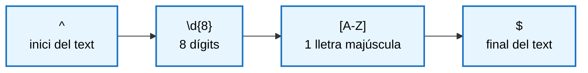

> **DSAW**  **RA5** - **FORMULARIS, VALIDACIÓ I EXPRESSIONS REGULARS**
>
> **Mòdul**: Client (0612)
>
> **Estat**: **En revisió**


# Formularis, validació i expressions regulars


## Què aprendràs

En acabar aquesta unitat has de ser capaç de:

- Explicar per què cal validar les dades, per què es fa al client i per què també s'ha de fer al servidor.
- Distingir els tipus de validació que es poden fer al client.
- Llegir i controlar els camps d'un formulari des del codi i aprofitar la validació que ja ofereix l'HTML.
- Entendre i escriure **expressions regulars** senzilles per comprovar el format de les dades.
- Validar formularis amb esdeveniments i mostrar els errors a la pàgina de manera clara i accessible.
- Provar i documentar el codi de validació d'un formulari.

> **Nota:** aquest és el segon document de teoria de la RA5. Abans cal haver treballat el document *Gestió d'esdeveniments* i la RA6 (*El model d'objectes del document*): aquí es fan servir `addEventListener`, l'objecte `event` i `preventDefault()`, i es modifica el DOM per mostrar els errors.

---

## Índex

1. [La validació de formularis](#1-la-validació-de-formularis)
2. [La validació nativa de l'HTML](#2-la-validació-nativa-de-lhtml)
3. [Formularis des de JavaScript](#3-formularis-des-de-javascript)
4. [Validar formularis amb esdeveniments](#4-validar-formularis-amb-esdeveniments)
5. [Validar formularis amb l'API de validació](#5-validar-formularis-amb-lapi-de-validació)
6. [Com mostrar els errors](#6-com-mostrar-els-errors)
7. [Expressions regulars](#7-expressions-regulars)

---

## 1. La validació de formularis

### 1.1 Per què cal validar les dades

Quan algú omple un formulari es pot equivocar: pot deixar en blanc un camp obligatori, escriure el correu sense `@`, posar lletres al telèfon o triar una data de tornada anterior a la d'anada. També hi ha qui hi introdueix dades de mala fe a propòsit: textos molt llargs o fragments de codi.

Si aquestes dades arriben a l'aplicació sense cap control, apareixen problemes:

| Problema | Exemple |
| :--- | :--- |
| Dades incompletes | Un registre sense correu electrònic |
| Format incorrecte | Un telèfon `6123` |
| Dades incoherents | Les dues contrasenyes no coincideixen, la data de fi és anterior a la d'inici |
| Dades malicioses | Un text que conté `<script>` o milers de caràcters |

**Validar** les dades té tres objectius:

- **Qualitat de les dades:** el que es guarda és complet, correcte i coherent.
- **Seguretat:** les dades malicioses no arriben a fer mal.
- **Experiència d'usuari:** l'usuari sap què ha fet malament i com corregir-ho.

### 1.2 Per què validar al client

La validació al client es fa al navegador, abans d'enviar les dades al servidor. Aporta tres avantatges:

- **Resposta immediata.** L'error apareix per pantalla, sense que hagi d'esperar la resposta del servidor.
- **Menys peticions al servidor.** Un formulari incorrecte no s'envia. Així s'estalvien peticions inútils, trànsit de xarxa i recursos del servidor.
- **Guia per a l'usuari.** Els missatges poden explicar què falta exactament ("Ha de tenir 8 números i una lletra") en lloc d'un error genèric.

### 1.3 La validació també s'ha de fer al servidor

Com es va veure a la RA1, el codi del client no és segur: s'executa a l'ordinador de l'usuari i, per tant, l'usuari el pot desactivar o modificar. A més, es poden enviar dades al servidor directament, sense passar pel formulari (amb un programa o un script).

Per això la validació al servidor s'ha de fer sempre, per motius de seguretat.

| Validació | Per a què serveix |
| :--- | :--- |
| Al **client** (aquesta unitat) | Comoditat de l'usuari i eficiència: detecta els errors a l'instant i evita enviaments inútils |
| Al **servidor** (mòdul d'entorn servidor) | Seguretat: és l'única que garanteix que les dades que es guarden són correctes |

> **Recorda:** la validació al client millora l'experiència d'usuari, però no protegeix l'aplicació. Les dades s'han de validar sempre als dos llocs.

### 1.4 Tipus de validació al client

Les validacions es poden classificar segons què comproven:

| Tipus | Què comprova | Exemple |
| :--- | :--- | :--- |
| Obligatorietat | Que el camp no estigui buit | El nom és obligatori |
| Format | Que el valor tingui la forma esperada | Un correu amb `@`, un codi postal de 5 dígits |
| Llargada i rang | Que el text o el número estigui entre uns límits | Contrasenya de 8 caràcters com a mínim, edat entre 16 i 99 |
| Coherència entre camps | Que diversos camps tinguin sentit junts | Les dues contrasenyes coincideixen |
| Regles de càlcul | Que el valor compleixi una regla que cal calcular | La lletra del DNI correspon al número |

---

## 2. La validació nativa de l'HTML

L'HTML pot comprovar moltes coses sense JavaScript. Si un camp no compleix les condicions, el navegador no envia el formulari i mostra un missatge propi.

| Atribut | Què comprova | Exemple |
| :--- | :--- | :--- |
| `required` | Que el camp no estigui buit | `<input required>` |
| `type` | El format segons el tipus: `email`, `url`, `number`... | `<input type="email">` |
| `min`, `max`, `step` | El rang d'un número o una data | `<input type="number" min="16" max="99">` |
| `minlength`, `maxlength` | La llargada del text | `<input minlength="8">` |
| `pattern` | Que el valor compleixi una expressió regular (apartat 7) | `<input pattern="\d{5}">` |
| `title` | No valida: text d'ajuda que apareix en passar el ratolí per sobre del camp i que acompanya el missatge d'error de `pattern` | `<input title="5 dígits">` |
| `placeholder` | No valida: text d'exemple que apareix dins del camp mentre és buit | `<input placeholder="nom@exemple.cat">` |

```html
<form>
  <label for="nom">Nom</label>
  <input type="text" id="nom" required minlength="2" maxlength="20"
         pattern="[\p{L} ]{2,20}" title="Només lletres i espais, entre 2 i 20 caràcters">

  <label for="email">Correu</label>
  <input type="email" id="email" required placeholder="nom@exemple.cat">

  <label for="cp">Codi postal</label>
  <input type="text" id="cp" pattern="\d{5}" title="5 dígits" inputmode="numeric">

  <button type="submit">Enviar</button>
</form>
```

> **Nota:** al patró del nom, `\p{L}` vol dir "qualsevol lletra", també amb accent, `ç` o `ñ`. Amb `[A-Za-z]` es rebutjarien noms com "Àngel" o "Núria".

Avantatges i límits:

| Avantatges | Límits |
| :--- | :--- |
| No cal escriure codi | L'aspecte dels missatges depèn del navegador i no es pot canviar |
| Funciona encara que JavaScript falli | No pot fer comprovacions complexes (la lletra del DNI, que dues contrasenyes coincideixin) |
| El navegador adapta el teclat al mòbil (`type`, `inputmode`) | Els missatges surten d'un en un i desapareixen |

### 2.1 Desactivar la validació del navegador: `novalidate`

Quan volem mostrar els errors amb el nostre propi disseny, s'afegeix l'atribut `novalidate` al formulari. El navegador deixa de bloquejar l'enviament i de mostrar els seus missatges, i la validació passa a ser responsabilitat del nostre codi.

```html
<form id="form-registre" novalidate>
```

---

## 3. Formularis des de JavaScript

### 3.1 Llegir els camps

```html
<form id="form-inscripcio">
  <label for="nom">Nom</label>
  <input type="text" id="nom" name="nom">

  <label for="edat">Edat</label>
  <input type="number" id="edat" name="edat">

  <label for="email">Correu electrònic</label>
  <input type="email" id="email" name="email" required>

  <label for="curs">Curs</label>
  <select id="curs" name="curs">
    <option value="daw1">1r DAW</option>
    <option value="daw2">2n DAW</option>
  </select>

  <p>Torn</p>
  <label><input type="radio" name="torn" value="mati" checked> Matí</label>
  <label><input type="radio" name="torn" value="tarda"> Tarda</label>

  <label><input type="checkbox" id="condicions" name="condicions"> Accepto les condicions</label>

  <button type="submit">Enviar</button>
</form>
```

| Tipus de camp | Com es llegeix | Què retorna |
| :--- | :--- | :--- |
| Text, número, correu, `<textarea>` | `camp.value` | Sempre un string |
| `<select>` | `select.value` | El `value` de l'opció triada |
| Casella de selecció (*checkbox*) | `camp.checked` | `true` o `false` |
| Botons d'opció (*radio*) | Cal buscar el marcat: `input[name="torn"]:checked` | L'element marcat |

```js
const form = document.querySelector("#form-inscripcio");

const nom = document.querySelector("#nom").value.trim();            // treu espais inicials i finals
const edat = Number(document.querySelector("#edat").value);         // string → número
const correu = document.querySelector("#email").value.trim();
const curs = document.querySelector("#curs").value;                 // "daw1" o "daw2"
const torn = form.querySelector('input[name="torn"]:checked').value;
const accepta = document.querySelector("#condicions").checked;      // true o false
```

> **Compte:** `value` retorna sempre un string, fins i tot en un `<input type="number">`. Converteix-lo amb `Number()` abans de fer càlculs o comparacions numèriques (RA2).

### 3.2 `form.elements`

Un formulari té la propietat `elements`, que dona accés a tots els seus camps pel seu atribut `name`:

```js
const form = document.querySelector("#form-inscripcio");

form.elements.nom.value;          // el mateix que document.querySelector("#nom").value
form.elements.email.value;
form.elements.condicions.checked;
form.elements.torn.value;         // en els botons d'opció, retorna directament el valor marcat
```

### 3.3 Enviar i buidar el formulari

L'esdeveniment `submit` es produeix quan s'envia el formulari, tant si es fa clic al botó d'enviar com si es prem Enter dins d'un camp. Per això s'escolta `submit` al formulari i no `click` al botó.

```js
form.addEventListener("submit", (event) => {
  event.preventDefault();         // evita que la pàgina es recarregui
  console.log(`Inscripció de ${form.elements.nom.value}`);
  form.reset();                   // buida tots els camps
});
```

L'atribut `type` del `<button>` determina què fa dins d'un formulari:

| `type` | Què fa |
| :--- | :--- |
| `submit` | Envia el formulari. **És el valor per defecte** |
| `reset` | Torna tots els camps al valor inicial |

> **Compte:** un `<button>` sense `type` dins d'un formulari és un botó d'enviar. Si afegeixes un botó per a una altra acció (per exemple, "Mostrar contrasenya"), posa-hi `type="button"` o enviarà el formulari.

---

## 4. Validar formularis amb esdeveniments

Validar un formulari amb JavaScript vol dir comprovar cada camp, mostrar els errors a la pàgina i no enviar-lo fins que tot sigui correcte. Combina el que has vist fins ara: els esdeveniments (document *Gestió d'esdeveniments*), el context de la validació (apartat 1), la validació nativa (apartat 2), la lectura dels camps des de JavaScript (apartat 3) i la modificació del DOM (RA6). Per comprovar el format de les dades es fan servir expressions regulars (apartat 7).

### 4.1 Esdeveniments en un formulari

| Esdeveniment | On s'escolta | Quan es produeix |
| :--- | :--- | :--- | 
| `submit` | Al `<form>` | En enviar el formulari, amb el botó o amb la tecla Enter | 
| `input` | Al camp | A cada canvi del valor, mentre s'escriu | 
| `change` | Al camp | Quan el valor ha canviat i el canvi es confirma: en sortir d'un camp de text, o en triar una opció d'un `<select>`, una casella o un botó d'opció | 
| `blur` | Al camp | Quan se surt del camp | 
| `invalid` | Al camp | Quan es comprova la validació nativa (`checkValidity()` o en enviar sense `novalidate`) i el camp no la compleix | 

### 4.2 Quan validar: estratègies

Com hauríem d'utilitzar els esdeveniments per validar els formularis:
| Estratègia | Esdeveniment | Avantatge | Inconvenient |
| :--- | :--- | :--- | :--- |
| En enviar | `submit` del formulari | Senzilla. Sempre s'ha de fer | L'usuari no veu els errors fins al final |
| En sortir del camp | `blur`, `change` de cada camp | L'error apareix quan l'usuari acaba d'escriure o canviar la selecció | L'error no desapareix fins que torna a sortir del camp |
| Mentre s'escriu | `input` de cada camp | Resposta immediata | Mostra errors abans que l'usuari hagi acabat d'escriure |
| **Combinada** (recomanada) | `blur` i, si ja hi ha error, `input` | L'error apareix en acabar i desapareix tan bon punt es corregeix | Una mica més de codi |

> **Recorda:** la validació en el `submit` s'ha de fer sempre, tant si es fa servir una altra estratègia com si no, perquè l'usuari pot prémer "Enviar" sense haver passat per tots els camps.

---

## 5. Validar formularis amb l'API de validació

Els camps d'un formulari també es poden validar des de JavaScript amb l'API de validació del navegador:

| Mètode o propietat | Què fa |
| :--- | :--- |
| `camp.checkValidity()` | Retorna `true` si el camp compleix totes les condicions |
| `form.checkValidity()` | Retorna `true` si tots els camps del formulari les compleixen |
| `camp.validity` | Objecte que indica quina condició falla |
| `camp.validationMessage` | El missatge d'error que mostraria el navegador |
| `camp.setCustomValidity(text)` | Marca el camp com a invàlid amb un missatge propi. Amb `""` el torna a marcar com a vàlid |

| Propietat de `validity` | És `true` si... |
| :--- | :--- |
| `valueMissing` | És `required` i està buit |
| `typeMismatch` | El format no correspon al `type` (per exemple, un correu sense `@`) |
| `patternMismatch` | No compleix el `pattern` |
| `tooShort` / `tooLong` | No compleix `minlength` / `maxlength` |
| `rangeUnderflow` / `rangeOverflow` | No compleix `min` / `max` |
| `valid` | Ho compleix tot |


```js
const email = document.querySelector("#email");

email.addEventListener("blur", () => {
  if (email.validity.valueMissing) {
    console.log("El correu és obligatori");
  } else if (email.validity.typeMismatch) {
    console.log("El format del correu no és correcte");
  }
});
```
---

## 6. Com mostrar els errors

Una validació correcta no serveix de res si l'usuari no entén què ha fet malament. Quan un camp falla, l'usuari ha de poder respondre tres preguntes sense esforç: **quin** camp és incorrecte, **per què** i **com** ho pot corregir.

### 6.1 On mostrar els errors

| Lloc | Quan s'utilitza | Valoració |
| :--- | :--- | :--- |
| Al costat del camp | Sempre | Recomanat: l'usuari veu l'error just on ha d'actuar |
| Resum a l'inici del formulari | En enviar formularis llargs, a més dels errors de cada camp | Recomanat com a complement |

> **Compte:** no utilitzis la finestra `alert()` per mostrar errors de validació: bloqueja la pàgina, desapareix en tancar-la i no indica el camp.

### 6.2 Com marcar visualment el camp

El camp erroni s'ha de distingir de la resta, però **no només amb el color**. Una persona amb daltonisme pot no distingir el vermell del verd, i per això el color sempre va acompanyat del missatge de text i d'un canvi de forma, com una vora més gruixuda:

```css
/* Camp amb error: color i gruix de la vora */
input.invalid {
  border: 2px solid #c92a2a;
}

/* El focus ha de continuar sent visible també en un camp erroni */
input.invalid:focus {
  outline: 3px solid #ffa8a8;
}

.ajuda {
  color: #495057;
  display: block;
  font-size: 0.85rem;
}

.missatge-error {
  color: #c92a2a;
  display: block;
  font-size: 0.85rem;
  min-height: 1.2em;          /* reserva l'espai i evita que el formulari salti */
}
```

> **Compte:** quan hi ha un error, no esborris el valor que l'usuari ha escrit. Ha de poder corregir-lo, no tornar-lo a escriure sencer. El `form.reset()` només es fa quan l'enviament ha anat bé.

### 6.3 Errors accessibles

| Recurs | Què fa |
| :--- | :--- |
| `<label for="...">` | Associa el text del camp amb el camp. Clicar l'etiqueta posa el focus al camp |
| `aria-live="polite"` | El lector de pantalla llegeix el missatge quan canvia |
| `aria-invalid="true"` | Indica al lector de pantalla que el camp té un error |
| `aria-describedby` | Enllaça el camp amb el text d'ajuda i amb el missatge d'error |
| Focus al primer camp erroni | En enviar, l'usuari va directament on ha de corregir |

### 6.4 Confirmar que tot ha anat bé

Quan el formulari és correcte, l'usuari també ha de rebre una resposta clara. Si el formulari es buida sense cap missatge, no sap si s'ha enviat. Per això, abans de buidar-lo, es mostra un missatge en un element amb `aria-live="polite"`:

```html
<p id="resultat" aria-live="polite"></p>
```

```js
const resultat = document.querySelector("#resultat");

// Dins del gestor de submit, quan tots els camps són correctes
resultat.textContent = `Registre completat. Benvingut/da, ${form.elements.nom.value.trim()}.`;
form.reset();
```

> **Recorda:** un bon missatge d'error diu quin camp falla, per què i com corregir-lo. Es mostra al costat del camp, no depèn només del color i no esborra el que l'usuari ha escrit.

---

## 7. Expressions regulars

Una **expressió regular** (*regular expression*, abreujat **regex**) és un patró que descriu com ha de ser un text. Per exemple, "cinc dígits seguits" o "vuit números i una lletra".

Serveixen per comprovar si un text té un format concret, per trobar-ne parts i per substituir-les. A l'entorn client s'utilitzen sobretot per a la primera tasca, **validar les dades d'un formulari**.

### 7.1 Com s'escriuen i com es proven

A JavaScript, una expressió regular s'escriu entre dues barres `/ /`. Per saber si un text compleix el patró es fa servir el mètode `test()`, que retorna `true` o `false`:

```js
const patro = /hola/;

patro.test("hola món");     // true: el text conté "hola"
patro.test("adéu");         // false
patro.test("Hola món");     // false: distingeix majúscules i minúscules
```

> **Nota:** les expressions regulars tenen altres mètodes, com `match()` (retorna les coincidències) i `replace()` (les substitueix), però per validar només cal `test()`.

### 7.2 Els elements bàsics

#### Caràcters especials

Alguns símbols representen un tipus de caràcter en lloc d'un caràcter concret:

| Símbol | Significat | Exemple que el compleix |
| :--- | :--- | :--- |
| `.` | Qualsevol caràcter | `a`, `7`, `-` |
| `\d` | Un dígit (0–9) | `5` |
| `\w` | Una lletra sense accent, un dígit o `_` | `a`, `Z`, `3` |
| `\s` | Un espai en blanc | ` ` |

#### Conjunts: `[ ]`

Entre claudàtors s'escriu la llista de caràcters permesos. Tot el conjunt representa **un sol caràcter**:

| Patró | Significat |
| :--- | :--- |
| `[aeiou]` | Una vocal |
| `[a-z]` | Una lletra minúscula, de la `a` a la `z` (rang) |
| `[A-Z0-9]` | Una lletra majúscula o un dígit |
| `[^0-9]` | Qualsevol caràcter que **no** sigui un dígit |

#### Quantificadors

Indiquen quantes vegades es repeteix l'element que tenen just al davant:

| Quantificador | Vegades |
| :--- | :--- |
| `?` | 0 o 1 (opcional) |
| `*` | 0 o més |
| `+` | 1 o més |
| `{n}` | Exactament *n* |
| `{n,m}` | Entre *n* i *m* |
| `{n,}` | Com a mínim *n* |

> **Compte:** per indicar "com a màxim *m*" s'escriu `{0,m}`. La forma `{,m}` no funciona a JavaScript.

#### Exemples

| Patró | Vàlids | No vàlids |
| :--- | :--- | :--- |
| `^ab?c$` | `ac`, `abc` | `abbc` |
| `^ab+c$` | `abc`, `abbbc` | `ac` |
| `^\d{3}$` | `123`, `007` | `12`, `12a` |
| `^[a-z]+$` | `hola` | `Hola`, `hola1` |

Els símbols `^` i `$` que envolten aquests patrons s'expliquen a l'apartat següent.

### 7.3 Inici i final del text: `^` i `$`

`test()` retorna `true` si el patró apareix **en qualsevol lloc** del text. Per validar un camp volem que el valor sencer compleixi el patró, i per això el patró s'emmarca entre `^` (inici del text) i `$` (final del text):

```js
// MALAMENT: accepta el valor perquè conté 5 dígits seguits en algun lloc
/\d{5}/.test("08001abc");     // true

// BÉ: el valor ha de ser exactament 5 dígits
/^\d{5}$/.test("08001abc");   // false
/^\d{5}$/.test("08001");      // true
```

> **Recorda:** per validar un camp, el patró va sempre entre `^` i `$`. A l'atribut `pattern` de l'HTML no cal posar-los, perquè el navegador ja comprova el valor sencer.

Altres símbols útils:

| Símbol | Significat | Exemple |
| :--- | :--- | :--- |
| `\|` | Una opció o l'altra | `^(si\|no)$` accepta `si` i `no` |
| `( )` | Agrupa una part del patró | `^(ab)+$` accepta `ab`, `abab` |
| `\` | Fa que un símbol especial es llegeixi com a text | `\.` és un punt literal |

### 7.4 Patrons habituals en formularis

| Dada | Patró | Vàlid | No vàlid |
| :--- | :--- | :--- | :--- |
| Codi postal | `^\d{5}$` | `08001` | `8001`, `08001a` |
| Telèfon | `^[6789]\d{8}$` | `612345678` | `512345678`, `61234567` |
| Format de DNI | `^\d{8}[A-Z]$` | `12345678Z` | `1234567Z`, `12345678` |
| Correu (bàsic) | `^[^\s@]+@[^\s@]+\.[^\s@]+$` | `nom@institut.cat` | `nom@institut` |

Un patró es llegeix d'esquerra a dreta, element per element. Per exemple, el format del DNI:



