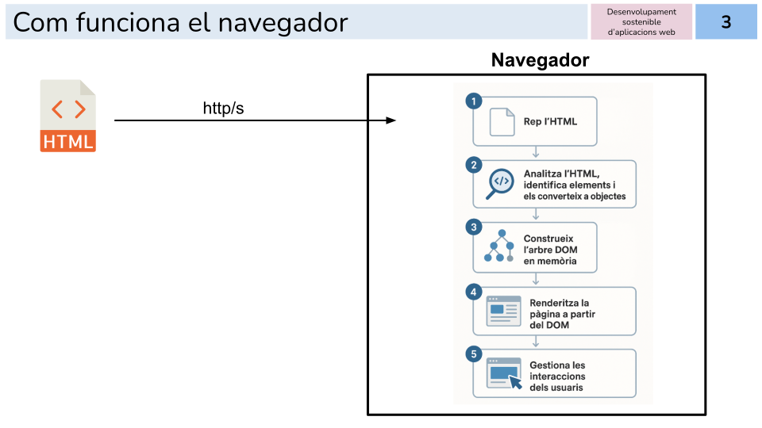
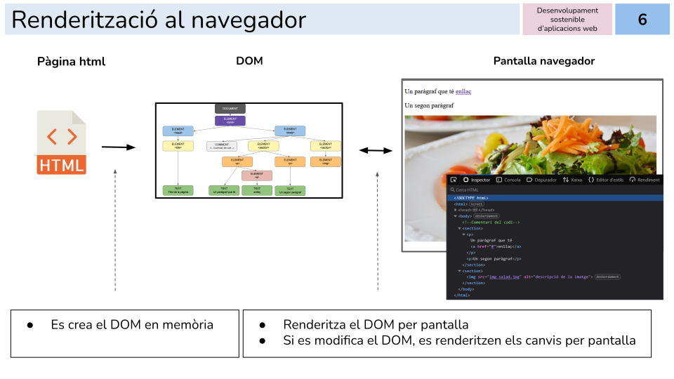
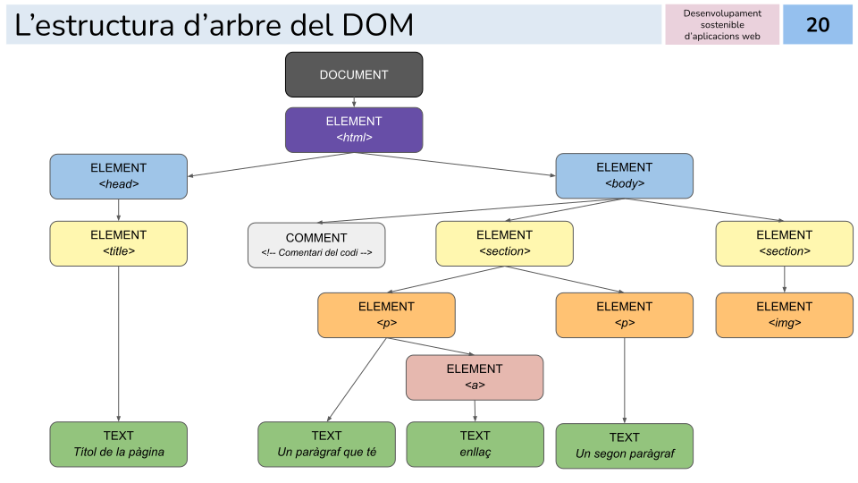
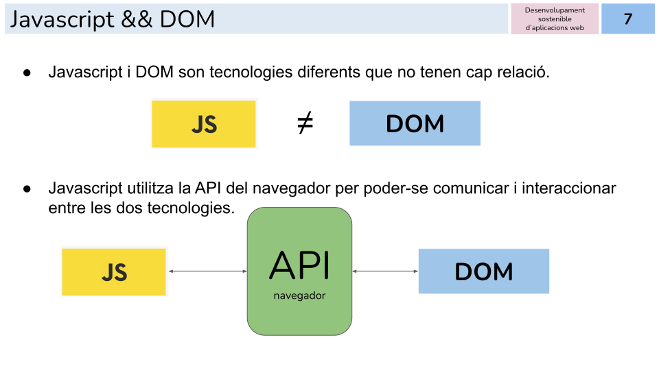
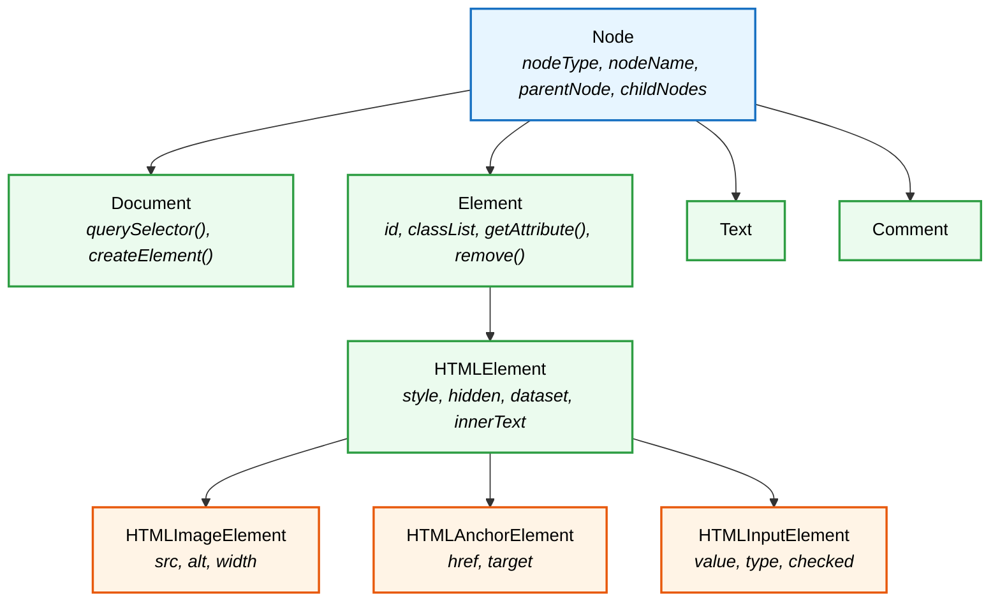
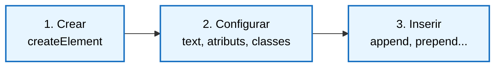
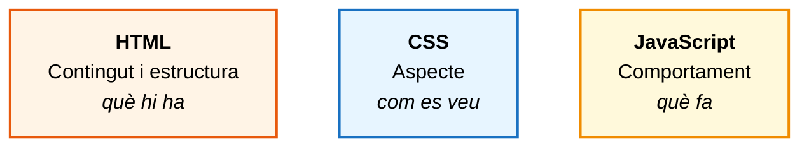

> **DSAW**  **RA6** - **MODEL D'OBJECTES DEL DOCUMENT (DOM)**
>
> **Mòdul**: Client (0612)
>
> **Estat**: **En revisió**


# El model d'objectes del document (DOM)


## Què aprendràs

En acabar aquesta unitat has de ser capaç de:

- Explicar què és el **DOM**, com el construeix el navegador i quina relació té amb JavaScript.
- Identificar els tipus de nodes de l'arbre, les relacions entre ells i els objectes, propietats i mètodes principals del model.
- Seleccionar elements del document i desplaçar-te per l'arbre des del codi, i verificar-ne el resultat amb les eines del navegador.
- Modificar el contingut, els atributs, els estils i les classes dels elements existents.
- Crear, inserir, substituir i eliminar elements, també a partir d'un conjunt de dades.
- Separar el contingut, l'aspecte i el comportament d'una aplicació web en tres capes independents.

> **Nota:** aquesta unitat es treballa conjuntament amb la RA5 (esdeveniments i formularis). Aquí aprendràs a llegir i modificar la pàgina; a la RA5 aprendràs a fer-ho com a resposta a les accions de l'usuari.

---

## Índex

1. [Què és el DOM](#1-què-és-el-dom)
2. [Accedir als elements](#2-accedir-als-elements)
3. [Modificar elements existents](#3-modificar-elements-existents)
4. [Crear i eliminar elements](#4-crear-i-eliminar-elements)
5. [Separació de capes: contingut, aspecte i comportament](#5-separació-de-capes-contingut-aspecte-i-comportament)
6. [El DOM a diferents navegadors](#6-el-dom-a-diferents-navegadors)

---

## 1. Què és el DOM

Quan el navegador rep un fitxer HTML, no el mostra tal com és. Primer l'analitza i en construeix una representació en memòria. Aquesta representació és el **DOM** (*Document Object Model*, model d'objectes del document).

> **DOM:** interfície de programació (API) del navegador que representa el document HTML com un **arbre d'objectes** i permet llegir-ne i modificar-ne el contingut, l'estructura i l'estil des del codi.

### 1.1 De l'HTML a la pantalla



El procés té cinc passos:

1. El navegador **rep** el document HTML del servidor.
2. L'**analitza**: identifica cada etiqueta i la converteix en un objecte.
3. **Construeix l'arbre** del DOM en memòria.
4. **Renderitza** (dibuixa) la pàgina a partir del DOM, no a partir del fitxer HTML.
5. Gestiona les interaccions de l'usuari.

El punt 4 és la idea clau de tota la unitat. El que es veu a la pantalla és el DOM, no el fitxer. Per això, quan JavaScript modifica el DOM, el navegador torna a dibuixar la part afectada i l'usuari veu el canvi, encara que el fitxer `index.html` del servidor continuï igual.



> **Recorda:** si fas *Veure codi font* al navegador, veuràs el fitxer original. Si obres les eines de desenvolupador (panell *Elements* o *Inspector*), veuràs el DOM actual, amb tots els canvis que hi hagi fet JavaScript.

### 1.2 L'arbre de nodes

Partim d'aquest document:

```html
<!DOCTYPE html>
<html>
  <head>
    <title>Títol de la pàgina</title>
  </head>
  <body>
    <!-- Comentari del codi -->
    <section>
      <p>Un paràgraf que té <a href="#">enllaç</a></p>
      <p>Un segon paràgraf</p>
    </section>
    <section>
      
    </section>
  </body>
</html>
```

El navegador el converteix en aquest arbre:



Cada requadre de l'arbre és un **node**. Hi ha diversos tipus de nodes:

| Tipus de node | Què representa | Exemple de l'arbre |
| :--- | :--- | :--- |
| **Document** | El document sencer. És el punt d'entrada al DOM | `document` |
| **Element** | Una etiqueta HTML | `<body>`, `<section>`, `<p>`, `<a>` |
| **Text** | El text que hi ha dins d'una etiqueta | "Un segon paràgraf" |
| **Comment** | Un comentari HTML | `<!-- Comentari del codi -->` |


### 1.3 JavaScript i el DOM

JavaScript i el DOM són dues tecnologies independents. El navegador proporciona una API per a que el JavaScript pugui accedir al DOM.



Dos objectes fan de porta d'entrada:

- **`window`**: representa la finestra o pestanya del navegador. És l'objecte global: tot el que declares fora d'una funció n'acaba formant part.
- **`document`**: representa la pàgina carregada dins de la finestra. És una propietat de `window` (`window.document`), però s'escriu sempre directament com a `document`.

A partir de `document` es pot:

- seleccionar elements;
- modificar-ne el contingut;
- consultar i modificar atributs;
- modificar estils i classes CSS;
- crear i eliminar elements.

> **Nota:** a la RA3 estudiarem a fons l'objecte `window` i la resta d'objectes del navegador. En aquesta unitat ens centrem en `document`.

### 1.4 Objectes, propietats i mètodes del model

Cada node del DOM és un objecte de JavaScript. Com a qualsevol objecte, té:

- **Propietats**: dades que descriuen el node i que es poden llegir o modificar. Per exemple, `textContent` (el text) o `id` (l'identificador).
- **Mètodes**: accions que el node sap fer. Per exemple, `remove()` (eliminar-se) o `querySelector()` (buscar dins seu).

No tots els nodes tenen les mateixes propietats. El DOM organitza els objectes en una jerarquia. Cada nivell hereta tot el que tenen els nivells superiors i hi afegeix el seu:



Per això una imatge té la propietat `src` i un paràgraf no: `src` és pròpia de `HTMLImageElement`. En canvi, tots dos tenen `classList`, perquè tots dos són `Element`.

Les propietats `nodeType` i `nodeName` permeten saber de quin tipus és un node:

```js
const titol = document.querySelector("h1");

console.log(titol.nodeName);              // "H1"
console.log(titol.nodeType);              // 1  (element)
console.log(document.nodeType);           // 9  (document)
```


> **Recorda:** la documentació de referència de totes les propietats i mètodes és [MDN Web Docs](https://developer.mozilla.org/ca/docs/Web/API/Document_Object_Model). Quan no sàpigues si un element té una propietat, consulta-hi l'objecte corresponent (per exemple, `HTMLImageElement`).


### 1.5 Quan està disponible el DOM

El codi que accedeix al DOM només funciona si l'arbre ja està construït. Com vas veure a la RA2, la manera recomanada d'assegurar-ho és carregar el fitxer JavaScript al `<head>` amb l'atribut `defer`:

```html
<head>
  <link rel="stylesheet" href="css/estils.css">
  <script src="js/app.js" defer></script>   <!-- BÉ: s'executa amb el DOM complet -->
</head>
```

---

## 2. Accedir als elements

### 2.1 `querySelector` i `querySelectorAll`

Són els mètodes recomanats, perquè accepten qualsevol **selector CSS**: el mateix que escriuries en un fitxer d'estils.

| Mètode | Què retorna | Si no troba res |
| :--- | :--- | :--- |
| `querySelector(selector)` | El **primer** element que coincideix | `null` |
| `querySelectorAll(selector)` | **Tots** els elements que coincideixen, en una `NodeList` | Una `NodeList` buida |

```html
<header>
  <h1 class="titol-principal">Hola món</h1>
  <h3 class="titol-principal">Subtítol</h3>
</header>
<ul id="menu">
  <li><a href="index.html">Inici</a></li>
  <li><a href="contacte.html" class="actiu">Contacte</a></li>
</ul>
```

```js
// Un sol element: el primer que coincideix
const titol = document.querySelector(".titol-principal");     // el <h1>
console.log(titol, typeof titol);
const menu = document.querySelector("#menu");                 // per id
const enllacActiu = document.querySelector("#menu a.actiu");  // selector combinat

// Tots els elements que coincideixen
const titols = document.querySelectorAll("header .titol-principal");
console.log(titols, typeof titols);              //retorna NodeList
for(let objHtml of titols)
{
    console.log(objHtml, typeof objHtml);       // <h1 class="titol-principal">
}

// Selector d'atribut
const enllacos = document.querySelectorAll('a[href$=".html"]');
console.log(enllacos, typeof enllacos);              //retorna NodeList
for(let objHtml of enllacos)
{
    console.log(objHtml, typeof objHtml);       // <h1 class="titol-principal">
}
```

### 2.2 Mètodes clàssics

Abans que existís `querySelector`, s'utilitzaven aquests mètodes. Encara es troben a molt de codi.

```js
// Per id (sense #). Retorna un element o null
const menu = document.getElementById("menu");

// Per classe (sense punt). Retorna una HTMLCollection
const titols = document.getElementsByClassName("titol-principal");

// Per nom d'etiqueta. Retorna una HTMLCollection
const paragrafs = document.getElementsByTagName("p");
```

> **Compte:** amb `getElementById` i `getElementsByClassName` el nom va **sense** `#` ni punt. Amb `querySelector` va **amb** `#` o punt, com a CSS. És un error molt habitual.

> **Actualment és més recomanable utilitzar `querySelector` i `querySelectorAll`**

### 2.3 `NodeList` i `HTMLCollection`

Quan un mètode retorna diversos elements, no retorna un array sinó una col·lecció. N'hi ha de dos tipus i es comporten diferent:

| | `NodeList` | `HTMLCollection` |
| :--- | :--- | :--- |
| Qui la retorna | `querySelectorAll` | `getElementsByClassName`, `getElementsByTagName` |
| Actualització | **Estàtica**: és una fotografia del moment | **Viva**: s'actualitza sola si el DOM canvia |
| `forEach` | Sí | No |
| `for...of` i `length` | Sí | Sí |


### 2.4 Navegar per l'arbre

Des d'un element es pot arribar als seus parents sense tornar a fer cap selecció.

```html
<article class="targeta">
  <h2>Títol</h2>
  <p class="descripcio">Descripció</p>
  <p class="preu">12 €</p>
</article>
```

```js
const descripcio = document.querySelector(".descripcio");

descripcio.parentElement;            // <article class="targeta">
descripcio.previousElementSibling;   // <h2>
descripcio.nextElementSibling;       // <p class="preu">

const targeta = descripcio.parentElement;
targeta.children;                    // HTMLCollection amb <h2>, <p>, <p>
targeta.firstElementChild;           // <h2>
targeta.lastElementChild;            // <p class="preu">

// closest: puja per l'arbre fins al primer avantpassat que coincideix amb el selector
const preu = document.querySelector(".preu");
preu.closest(".targeta");            // <article class="targeta">
```

---

## 3. Modificar elements existents

### 3.1 El contingut: `textContent`, `innerText` i `innerHTML`

```html
<h1 class="titol">Hola món</h1>
<p class="avis">Text inicial</p>
```

```js
const titol = document.querySelector(".titol");

// Llegir el contingut
console.log(titol.textContent);          // "Hola món"

// textContent: canvia el text. Les etiquetes es mostren com a text literal
titol.textContent = "Nou títol";
titol.textContent = "Text amb <em>etiquetes</em>";   // es veu: Text amb <em>etiquetes</em>

// innerHTML: interpreta el contingut com a HTML
const avis = document.querySelector(".avis");
avis.innerHTML = "Text amb <em>etiquetes</em>";      // es veu: Text amb *etiquetes* en cursiva
```

| Propietat | Què fa | Quan fer-la servir |
| :--- | :--- | :--- |
| `textContent` | Llegeix o escriu **text pla**. Retorna tot el text, també el que està ocult amb CSS | Opció per defecte per canviar textos |
| `innerText` | Llegeix o escriu el text **tal com es veu** a la pantalla. No retorna el text ocult amb CSS | Quan interessa només el text visible |
| `innerHTML` | Llegeix o escriu **HTML**, que el navegador interpreta | Només amb HTML escrit per tu, mai amb dades de l'usuari |

```html
<p class="exemple">Visible <span style="display: none">ocult</span></p>
```

```js
const p = document.querySelector(".exemple");
console.log(p.textContent);   // "Visible ocult"
console.log(p.innerText);     // "Visible"
```

#### El risc d'`innerHTML`

`innerHTML` executa com a HTML qualsevol text que rebi. Si aquest text ve de l'usuari (un camp de formulari, un comentari, un nom), un atacant hi pot escriure codi que el navegador executarà. Aquest atac s'anomena **XSS** (*Cross-Site Scripting*).

```js
// Imaginem que el nom l'ha escrit l'usuari en un formulari
const nomUsuari = '';

// MALAMENT: el navegador crea la imatge i executa robarDades()
salutacio.innerHTML = `Hola, ${nomUsuari}`;

// BÉ: es mostra el text tal qual, sense executar res
salutacio.textContent = `Hola, ${nomUsuari}`;
```

> **Compte:** fes servir `textContent` sempre que el contingut inclogui dades que no has escrit tu. Si necessites crear etiquetes, crea-les amb `createElement` (apartat 4).

### 3.2 Els atributs

Hi ha dues maneres d'accedir als atributs d'un element:

- **Com a propietat de l'objecte.** La majoria d'atributs HTML tenen una propietat amb el mateix nom:

```html

<a href="https://www.exemple.com">Enllaç a la pàgina</a>
```

```js
const img = document.querySelector("img");
img.src = "img2.jpg";
img.alt = "Nova descripció de la imatge";
img.id = "imatge-principal";

const enllac = document.querySelector("a");
enllac.href = "https://www.google.com";
enllac.target = "_blank";
```

- **Amb els mètodes d'atributs.** Treballen amb el nom de l'atribut tal com està escrit a l'HTML:

```js
const enllac = document.querySelector("a");

enllac.getAttribute("href");              // llegir
enllac.setAttribute("target", "_blank");  // crear o modificar
enllac.hasAttribute("title");             // comprovar si existeix: true o false
enllac.removeAttribute("target");         // eliminar
```

> **Compte:** alguns atributs tenen un nom de propietat diferent perquè el nom HTML és una paraula reservada de JavaScript: l'atribut `class` és la propietat `className`, i l'atribut `for` de `<label>` és la propietat `htmlFor`.

#### Atributs de dades: `data-*` i `dataset`

HTML permet afegir atributs propis a qualsevol element, sempre que el nom comenci per `data-`. Serveixen per guardar informació associada a l'element que el codi necessita però que no es mostra. JavaScript hi accedeix amb la propietat `dataset`:

```html
<article class="producte" data-id="42" data-preu="19.95" data-categoria-principal="llibres">
  <h2>El nom del vent</h2>
</article>
```

```js
const producte = document.querySelector(".producte");

console.log(producte.dataset.id);                    // "42"
console.log(producte.dataset.preu);                  // "19.95" (sempre és un string)
console.log(producte.dataset.categoriaPrincipal);    // "llibres"

// Modificar o crear un atribut de dades
producte.dataset.estoc = "3";     // afegeix data-estoc="3" a l'HTML
```

> **Recorda:** a l'HTML el nom va en minúscules i amb guions (`data-categoria-principal`); a `dataset` va en *camelCase* (`categoriaPrincipal`). Els valors sempre són strings: si necessites un número, converteix-lo amb `Number()`.

Els selectors també poden fer servir atributs de dades:

```js
const llibres = document.querySelectorAll('[data-categoria-principal="llibres"]');
```

### 3.3 Els estils en línia: la propietat `style`

La propietat `style` modifica l'atribut `style` de l'element, és a dir, els estils **en línia**. El nom de cada propietat CSS s'escriu en *camelCase*:

```js
const p = document.querySelector("p");

p.style.color = "red";
p.style.backgroundColor = "#f0f0f0";   // background-color
p.style.fontSize = "30px";             // font-size: cal indicar la unitat

p.style.color = "";                    // esborra l'estil en línia
```

El mètode `setProperty` fa el mateix, però rep el nom de la propietat tal com s'escriu a CSS. És necessari per treballar amb **variables CSS**:

```js
p.style.setProperty("padding-top", "15px");

// Variables CSS: només es poden modificar amb setProperty
document.documentElement.style.setProperty("--color-principal", "#1971c2");
```

> **Nota:** `style` només llegeix els estils en línia. Per saber quin estil té realment un element (el que ve del fitxer CSS), cal fer servir `getComputedStyle(element).color`.


### 3.4 Les classes: `classList`

Modificar estils un per un amb `style` barreja l'aspecte amb el comportament (ho veurem a l'apartat 5). La manera recomanada de canviar l'aspecte d'un element és definir les classes al CSS i afegir-les o treure-les des de JavaScript.

```css
/* estils.css: les classes han d'existir prèviament */
.destacat { background-color: #fff3bf; font-weight: bold; }
.error    { color: #c92a2a; }
.visible  { display: block; }
```

```js
const p = document.querySelector("p");

p.classList.add("destacat", "error");       // afegeix una o més classes
p.classList.remove("error");                // treu una classe
p.classList.toggle("visible");              // l'afegeix si no hi és; la treu si hi és
p.classList.contains("destacat");           // true o false
p.classList.replace("destacat", "error");   // substitueix una classe per una altra
```

La propietat `className` també existeix, però treballa amb totes les classes com un únic text i és fàcil esborrar-ne sense voler:

```js
// MALAMENT: substitueix totes les classes que tingués l'element
p.className = "destacat";

// BÉ: afegeix la classe i manté les que ja tenia
p.classList.add("destacat");
```

### 3.5 Amagar i mostrar elements

| Opció | L'element existeix al DOM? | Es veu? | Ocupa espai? |
| :--- | :---: | :---: | :---: |
| `display: none` | Sí | No | No |
| `visibility: hidden` | Sí | No | Sí |
| Atribut `hidden` | Sí | No | No |
| `remove()` | **No** | No | No |

> **Compte:** amagar un element no és el mateix que eliminar-lo. Un element amagat continua al DOM: es pot tornar a mostrar i `querySelector` el continua trobant. Un element eliminat ja no existeix.

---

## 4. Crear i eliminar elements

### 4.1 Crear un element i inserir-lo

Crear un element nou sempre segueix els mateixos passos:



```html
<div class="contenidor"></div>
```

```js
const contenidor = document.querySelector(".contenidor");

// 1. Crear: l'element existeix en memòria, però encara no és al document
const item = document.createElement("p");

// 2. Configurar
item.textContent = "Títol de l'ítem";
item.classList.add("text");

// 3. Inserir-lo dins del contenidor, al final
contenidor.append(item);
```

> **Compte:** fins que no s'insereix, l'element creat no apareix a la pantalla ni al panell *Elements*. Si "no surt res", comprova que no t'hagis oblidat del pas 3.

Hi ha diversos mètodes per inserir, segons on es vulgui col·locar l'element:

| Mètode | On l'insereix | Relació amb l'element de referència |
| :--- | :--- | :--- |
| `pare.append(nou)` | Al final, a dins | Últim fill |
| `pare.prepend(nou)` | Al principi, a dins | Primer fill |
| `referencia.before(nou)` | Just abans, a fora | Germà anterior |
| `referencia.after(nou)` | Just després, a fora | Germà següent |

```js
const contenidor = document.querySelector(".contenidor");

const primer = document.createElement("article");
primer.textContent = "Primer";
contenidor.prepend(primer);

const ultim = document.createElement("article");
ultim.textContent = "Últim";
contenidor.append(ultim);

// append accepta diversos nodes i també text
const peu = document.createElement("article");
peu.append("Total: ", contenidor.children.length, " elements");
contenidor.after(peu);
```

> **Nota:** també trobaràs `appendChild(nou)`, el mètode antic. Fa el mateix que `append`, però només accepta un node (no text) i un de cada vegada.

### 4.2 `insertAdjacentElement`, `insertAdjacentHTML` i `insertAdjacentText`

Aquests tres mètodes insereixen contingut en una de quatre posicions respecte d'un element:

```html
<!-- beforebegin -->
<div id="contenidor">
  <!-- afterbegin -->
  Contingut existent
  <!-- beforeend -->
</div>
<!-- afterend -->
```

| Mètode | Què insereix |
| :--- | :--- |
| `insertAdjacentElement(posicio, element)` | Un element creat amb `createElement` |
| `insertAdjacentHTML(posicio, text)` | Text que el navegador interpreta com a HTML |
| `insertAdjacentText(posicio, text)` | Només text pla |

```js
const contenidor = document.querySelector("#contenidor");

// Element creat prèviament
const item = document.createElement("p");
item.textContent = "Nou paràgraf";
contenidor.insertAdjacentElement("beforeend", item);    // equival a append

// HTML escrit per nosaltres
contenidor.insertAdjacentHTML("afterbegin", "<h2>Títol <span>nou</span></h2>");

// Text pla
contenidor.insertAdjacentText("afterend", "Text després del contenidor");
```

> **Compte:** `insertAdjacentHTML` té el mateix risc que `innerHTML`. No hi posis mai dades que vinguin de l'usuari.

### 4.3 Eliminar i substituir

```html
<h1 class="titol">Títol</h1>
<div class="contenidor">
  <p>Paràgraf 1</p>
  <p class="esborrar">Paràgraf 2</p>
  <p>Paràgraf 3</p>
</div>
```

```js
// Eliminar un element
const titol = document.querySelector(".titol");
titol.remove();

// Forma antiga: el pare elimina un dels seus fills
const contenidor = document.querySelector(".contenidor");
const par2 = document.querySelector(".esborrar");
contenidor.removeChild(par2);

// Substituir un element per un altre
const nouTitol = document.createElement("h2");
nouTitol.textContent = "Títol substituït";
contenidor.firstElementChild.replaceWith(nouTitol);

// Buidar un contenidor (elimina tots els fills)
contenidor.replaceChildren();
// Alternativa habitual: contenidor.textContent = "";

```

> **Recorda:** `remove()` és el mètode actual i el més senzill. `removeChild()` el trobaràs a codi antic.


---

## 5. Separació de capes: contingut, aspecte i comportament

Una aplicació web té tres capes, i cadascuna és responsabilitat d'un llenguatge:



**Independitzar les capes** vol dir que cada capa està en el seu fitxer i que cap no s'hi fica en la feina de les altres. Així:

- es pot canviar tot el disseny sense tocar ni l'HTML ni el JavaScript;
- es pot reutilitzar el mateix fitxer CSS o JS en diverses pàgines;
- diverses persones poden treballar alhora en capes diferents;
- el codi és més fàcil de llegir, provar i mantenir.

### 5.1 Estructura de fitxers

```
projecte/
├── index.html        → només contingut
├── css/
│   └── estils.css    → tot l'aspecte
└── js/
    └── app.js        → tot el comportament
```

### 5.2 Regles pràctiques

| Regla | Incorrecte | Correcte |
| :--- | :--- | :--- |
| Sense estils en línia a l'HTML | `<p style="color: red">` | `<p class="avis">` + regla al CSS |
| Sense JavaScript a l'HTML | `<script>` amb codi, atributs `onclick`, `onload`... | `<script src="..." defer>` |
| JavaScript canvia classes, no estils | `el.style.color = "red"` | `el.classList.add("error")` |
| Les dades per al codi van en `data-*` | Informació amagada en el text o en classes | `data-estoc="0"` |
| Sense HTML complex dins del JavaScript | Grans blocs d'`innerHTML` | `createElement` o una estructura base a l'HTML |

> **Nota:** hi ha casos en què `style` des de JavaScript sí que té sentit: quan el valor es calcula en el moment i no es pot definir prèviament en una classe. Per exemple, l'amplada d'una barra de progrés (`` barra.style.width = `${percentatge}%` ``) o una posició calculada.

---

## 6. El DOM a diferents navegadors

### 6.1 Com comprovar la compatibilitat

Abans de fer servir un mètode o una propietat poc habitual, cal comprovar quins navegadors el suporten.

- **MDN Web Docs**: cada pàgina de referència acaba amb una taula de compatibilitat (*Browser compatibility*) i, a la part superior, una etiqueta **Baseline** que indica si la funcionalitat funciona a tots els navegadors principals.
- **[Can I use](https://caniuse.com)**: permet cercar qualsevol funcionalitat i veure en quines versions de cada navegador està disponible i quin percentatge d'usuaris la pot fer servir.

---

